# AI 数据分析系统 — DDD 领域设计文档

> Generated from: AI数据分析系统PRD.md
> Date: 2026-03-30
> Status: Phase 0-3 (Strategic & Tactical Design)

---

## 0. Event Storming（事件风暴）

> 事件风暴是从业务流程出发，识别**谁**（Actor）要**做什么**（Command），需要满足**什么条件**（Command Specification），
> 由**哪个聚合**（Aggregate）处理，产生**什么结果**（Domain Event），以及事件发生后**触发什么后续动作**（Policy）。

### 0.1 Event Storming 全景图

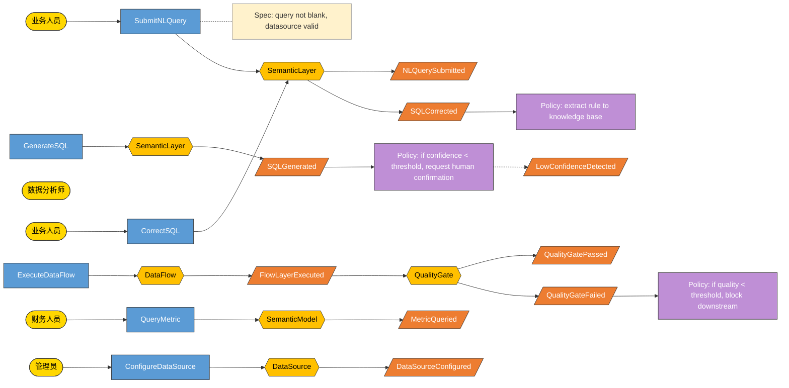

---

### 0.2 Actor（参与者）

| Actor | 角色描述 | 触发的 Command (Application 层) |
| ----- | -------- | ------------------------------- |
| 业务人员 | 使用自然语言进行数据查询和消费报表 | SubmitNLQuery, CorrectSQL, QueryMetric |
| 数据分析师 | 配置和管理数据流程，执行复杂分析 | ExecuteDataFlow, ConfigureDataFlow, CreateQualityTest |
| 管理员 | 系统配置、数据源管理、用户权限管理 | ConfigureDataSource, ManageUserPermission |
| 运维 | 系统监控、部署维护 | ConfigureTrigger, ViewExecutionLog |
| AI系统 | 内部自动触发（定时/事件驱动） | ExecuteDataFlow, RunQualityCheck |

---

### 0.3 Command（应用命令）

| Command | 归属层 | Actor | 目标 Aggregate | 产生的 Event | Description |
| ------- | ------ | ----- | -------------- | ------------ | ----------- |
| `SubmitNLQueryCommand` | Application | 业务人员 | SemanticLayer | NLQuerySubmitted | 提交自然语言查询 |
| `GenerateSQLCommand` | Application | AI系统 | SemanticLayer | SQLGenerated, LowConfidenceDetected | AI生成SQL |
| `ConfirmSQLCommand` | Application | 业务人员 | SemanticLayer | SQLConfirmed | 确认低置信度SQL |
| `CorrectSQLCommand` | Application | 业务人员 | SemanticLayer | SQLCorrected | 修正AI生成的SQL |
| `ExecuteDataFlowCommand` | Application | 数据分析师/AI系统 | DataFlow | FlowLayerExecuted | 执行数据流程 |
| `ConfigureDataFlowCommand` | Application | 数据分析师 | DataFlow | DataFlowConfigured | 配置数据流程 |
| `RunQualityCheckCommand` | Application | AI系统 | QualityGate | QualityGatePassed, QualityGateFailed | 执行质量检查 |
| `ConfigureDataSourceCommand` | Application | 管理员 | DataSource | DataSourceConfigured | 配置数据源 |
| `QueryMetricCommand` | Application | 业务人员/财务人员 | SemanticModel | MetricQueried | 查询语义指标 |
| `DefineMetricCommand` | Application | 数据分析师 | SemanticModel | MetricDefined | 定义语义指标 |
| `ManagePermissionCommand` | Application | 管理员 | Permission | PermissionChanged | 管理数据权限 |
| `DefineBusinessTableCommand` | Application | 数据分析师 | BusinessTable | BusinessTableDefined | 定义业务数据表 |
| `ConfigureSyncTaskCommand` | Application | 数据分析师 | DataSyncTask | SyncTaskConfigured | 配置数据同步任务 |
| `ExecuteSyncTaskCommand` | Application | AI系统 | DataSyncTask | SyncTaskStarted, SyncTaskCompleted, SyncTaskFailed | 执行数据同步 |
| `TriggerSyncCommand` | Application | AI系统/定时器 | DataSyncTask | SyncTriggered | 触发数据同步 |

---

### 0.4 Command Specification（命令规约）

#### CMD-01: SubmitNLQueryCommand 规约

| 规约项 | 规则 | 校验位置 | 失败处理 |
| ------ | ---- | -------- | -------- |
| queryText | 非空，长度 1-2000 | AppService 入参校验 | 返回错误提示 |
| businessTableId | 非空，业务数据表必须存在且已同步 | AppService | 返回错误提示 |
| userId | 非空，用户必须存在 | AppService | 返回错误提示 |

#### CMD-02: CorrectSQLCommand 规约

| 规约项 | 规则 | 校验位置 | 失败处理 |
| ------ | ---- | -------- | -------- |
| queryId | 非空，对应查询记录必须存在 | AppService | 返回错误提示 |
| correctedSQL | 非空，SQL语法必须合法 | AppService 基础校验 | 提示用户 |
| correctionReason | 可选，修正原因描述 | — | — |

#### CMD-03: ExecuteDataFlowCommand 规约

| 规约项 | 规则 | 校验位置 | 失败处理 |
| ------ | ---- | -------- | -------- |
| flowId | 非空，流程必须存在 | AppService | 返回错误提示 |
| startLayer | 可选，默认从第1层开始 | AppService | 默认为第1层 |
| executionMode | 枚举：SYNC/ASYNC | AppService | 默认为ASYNC |

#### CMD-04: DefineMetricCommand 规约

| 规约项 | 规则 | 校验位置 | 失败处理 |
| ------ | ---- | -------- | -------- |
| metricName | 非空，唯一性校验 | AppService | 提示名称冲突 |
| formula | 非空，公式语法正确 | Domain Service 解析 | 提示公式错误 |
| dimensions | 可选，维度列表 | — | — |

#### CMD-05: DefineBusinessTableCommand 规约

| 规约项 | 规则 | 校验位置 | 失败处理 |
| ------ | ---- | -------- | -------- |
| tableName | 非空，同一数据源下唯一性校验 | AppService | 提示名称冲突 |
| columns | 非空，至少包含一列 | AppService | 提示列不能为空 |
| datasourceId | 非空，对应数据源必须存在 | AppService + Gateway | 返回错误提示 |

#### CMD-06: ConfigureSyncTaskCommand 规约

| 规约项 | 规则 | 校验位置 | 失败处理 |
| ------ | ---- | -------- | -------- |
| taskName | 非空，同一业务表下唯一 | AppService | 提示名称冲突 |
| sourceTableId | 非空，源表必须存在 | AppService | 返回错误提示 |
| targetTableId | 非空，目标业务表必须存在 | AppService | 返回错误提示 |
| syncType | 枚举：FULL/INCREMENTAL | AppService | 默认为FULL |
| incrementalField | syncType=INCREMENTAL时必填 | AppService | 提示增量字段不能为空 |
| schedule | cron表达式，合法格式校验 | AppService | 提示cron表达式格式错误 |

#### CMD-07: ExecuteSyncTaskCommand 规约

| 规约项 | 规则 | 校验位置 | 失败处理 |
| ------ | ---- | -------- | -------- |
| taskId | 非空，同步任务必须存在 | AppService | 返回错误提示 |
| forceFullSync | 可选，强制全量同步 | AppService | 覆盖配置的syncType |

---

### 0.5 Domain Event（领域事件）

| Event | 产生时机 | 发布者 (Aggregate) | 事件数据 | 订阅者 / 后续 Policy |
| ----- | -------- | ------------------ | ------- | -------------------- |
| `NLQuerySubmitted` | 用户提交自然语言查询 | SemanticLayer | `{queryId, queryText, businessTableId, userId, timestamp}` | SQLGenerationPolicy |
| `SQLGenerated` | AI成功生成SQL | SemanticLayer | `{queryId, sqlText, confidence, usedTables, usedMappings, timestamp}` | — |
| `LowConfidenceDetected` | SQL置信度低于阈值 | SemanticLayer | `{queryId, confidence, threshold}` | HumanConfirmationPolicy |
| `SQLConfirmed` | 用户确认低置信度SQL | SemanticLayer | `{queryId, confirmedBy, timestamp}` | — |
| `SQLCorrected` | 用户修正SQL | SemanticLayer | `{queryId, originalSQL, correctedSQL, correctionReason, timestamp}` | KnowledgeExtractionPolicy |
| `FlowLayerExecuted` | 流程某层执行完成 | DataFlow | `{flowId, layerId, inputRows, outputRows, duration, timestamp}` | QualityCheckPolicy |
| `QualityGatePassed` | 质量门禁通过 | QualityGate | `{flowId, layerId, qualityScore, timestamp}` | DownstreamTriggerPolicy |
| `QualityGateFailed` | 质量门禁未通过 | QualityGate | `{flowId, layerId, qualityScore, threshold, violatedRules, timestamp}` | AlertPolicy, FlowBlockPolicy |
| `DataSourceConfigured` | 数据源配置完成 | DataSource | `{datasourceId, datasourceType, status, configuredBy, timestamp}` | — |
| `MetricQueried` | 指标被查询 | SemanticModel | `{metricId, metricName, queryContext, result, timestamp}` | — |
| `MetricDefined` | 指标定义完成 | SemanticModel | `{metricId, metricName, version, definedBy, timestamp}` | DownstreamRefreshPolicy |
| `PermissionChanged` | 权限变更 | Permission | `{permissionId, permissionType, targetId, changedBy, timestamp}` | — |
| `BusinessTableDefined` | 业务数据表定义完成 | BusinessTable | `{tableId, tableName, version, definedBy, timestamp}` | — |
| `SyncTaskConfigured` | 同步任务配置完成 | DataSyncTask | `{taskId, taskName, sourceTableId, targetTableId, syncType, timestamp}` | — |
| `SyncTriggered` | 同步任务被触发 | DataSyncTask | `{taskId, triggerType, timestamp}` | SyncExecutionPolicy |
| `SyncTaskStarted` | 同步任务开始执行 | DataSyncTask | `{taskId, startTime, estimatedRows, timestamp}` | — |
| `SyncTaskCompleted` | 同步任务执行完成 | DataSyncTask | `{taskId, syncedRows, duration, timestamp}` | — |
| `SyncTaskFailed` | 同步任务执行失败 | DataSyncTask | `{taskId, errorMessage, failedRows, timestamp}` | AlertPolicy |

---

### 0.6 Policy（策略/反应式规则）

| Policy | 触发事件 | 触发的 Command | 条件 | Description |
| ------ | -------- | ------------- | ---- | ----------- |
| `SQLGenerationPolicy` | NLQuerySubmitted | GenerateSQLCommand | 自动触发 | 接收到NL查询后自动触发SQL生成 |
| `HumanConfirmationPolicy` | LowConfidenceDetected | — | 等待人工确认 | 置信度低于阈值时暂停，等待用户确认 |
| `KnowledgeExtractionPolicy` | SQLCorrected | — | 自动提取规则 | 从修正历史中提取规则写入机构知识库 |
| `QualityCheckPolicy` | FlowLayerExecuted | RunQualityCheckCommand | 自动触发 | 每层ETL执行完成后自动触发质量检查 |
| `DownstreamTriggerPolicy` | QualityGatePassed | ExecuteDataFlowCommand | 下一层存在 | 质量通过后自动触发下游流程 |
| `FlowBlockPolicy` | QualityGateFailed | — | 阻断流程 | 质量不达标时阻止流程进入下一层 |
| `AlertPolicy` | QualityGateFailed | SendAlertCommand | 告警级别匹配 | 触发分级告警（Warning/Error/Critical） |
| `DownstreamRefreshPolicy` | MetricDefined | RefreshDownstreamCommand | 下游存在 | 指标变更后刷新所有下游消费者 |
| `SyncExecutionPolicy` | SyncTriggered | ExecuteSyncTaskCommand | 自动触发 | 定时任务或事件触发时执行数据同步 |
| `SyncConflictPolicy` | SyncTaskFailed | — | 冲突处理策略 | 同步冲突时按配置的策略处理（覆盖/忽略/人工介入） |

---

### 0.7 Read Model（读模型）

| Read Model | 对应 Command | 数据字段 | 数据来源 |
| ---------- | ------------ | -------- | -------- |
| `NLQueryReadModel` | SubmitNLQuery | queryText, sqlText, confidence, status, createdAt | SemanticLayer |
| `DataFlowExecutionReadModel` | ExecuteDataFlow | flowId, flowName, status, currentLayer, executionProgress | DataFlow |
| `QualityReportReadModel` | RunQualityCheck | flowId, layerId, qualityScore, violatedRules, metrics | QualityGate |
| `MetricQueryReadModel` | QueryMetric | metricName, formula, dimensions, latestValue, timestamp | SemanticModel |

---

### 0.8 External System（外部系统）

| External System | 交互方式 | 在哪个 Command 中使用 | 对应 Gateway |
| --------------- | -------- | --------------------- | ------------ |
| AI Model Service (NL→SQL) | HTTP/gRPC | GenerateSQLCommand | `AISQLGenerationGateway` |
| Database Connectors | JDBC | ExecuteDataFlow, QueryMetric | `DataSourceGateway` |
| SAP (财务系统) | API/JDBC | QueryMetric (成本数据) | `SAPGateway` |
| RocketMQ | MQ | ExecuteDataFlow (事件触发) | `MessageQueueGateway` |
| Email/DingTalk/Feishu | HTTP Webhook | AlertPolicy | `NotificationGateway` |
| Redis | Redis Client | 查询缓存, 会话管理 | `CacheGateway` |

---

### 0.9 Event Storming 时间线（按业务流程排列）

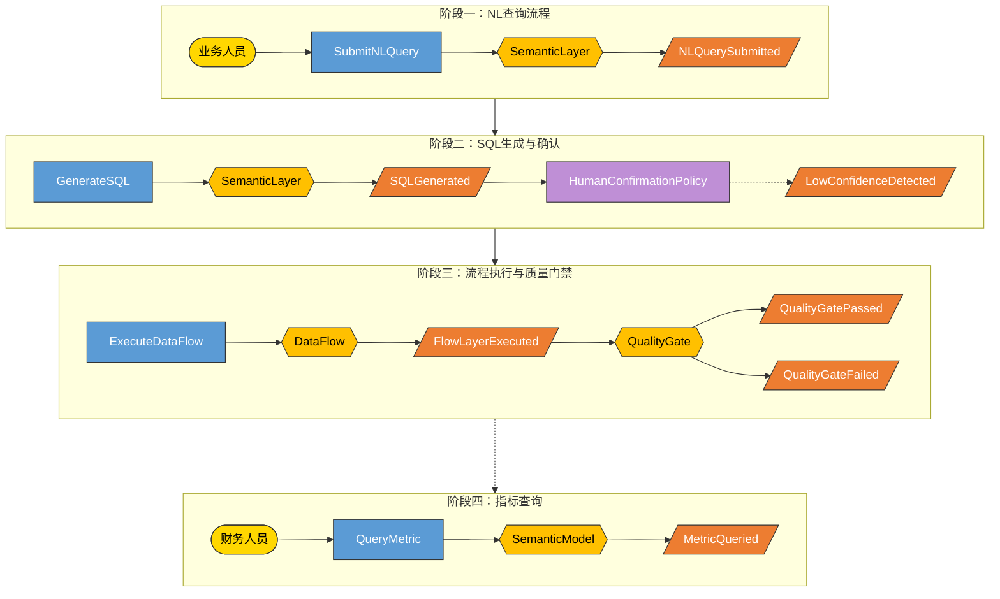

---

### 0.10 Command → Aggregate → Event 映射总表

| # | Actor | Command (Application 层) | Command Specification (入参校验) | Aggregate | Domain Event | Policy |
| - | ----- | ------------------------ | -------------------------------- | --------- | ------------ | ------ |
| 1 | 业务人员 | `SubmitNLQueryCommand` | queryText非空, datasourceId有效 | SemanticLayer | NLQuerySubmitted | SQLGenerationPolicy |
| 2 | AI系统 | `GenerateSQLCommand` | — | SemanticLayer | SQLGenerated, LowConfidenceDetected | HumanConfirmationPolicy |
| 3 | 业务人员 | `ConfirmSQLCommand` | queryId有效 | SemanticLayer | SQLConfirmed | — |
| 4 | 业务人员 | `CorrectSQLCommand` | queryId有效, correctedSQL非空 | SemanticLayer | SQLCorrected | KnowledgeExtractionPolicy |
| 5 | 数据分析师/AI | `ExecuteDataFlowCommand` | flowId有效, executionMode枚举 | DataFlow | FlowLayerExecuted | QualityCheckPolicy |
| 6 | 数据分析师 | `ConfigureDataFlowCommand` | flowName唯一, DSL合法 | DataFlow | DataFlowConfigured | — |
| 7 | AI系统 | `RunQualityCheckCommand` | flowId有效, layerId有效 | QualityGate | QualityGatePassed, QualityGateFailed | AlertPolicy, FlowBlockPolicy |
| 8 | 管理员 | `ConfigureDataSourceCommand` | datasourceType枚举, 连接参数完整 | DataSource | DataSourceConfigured | — |
| 9 | 业务人员/财务 | `QueryMetricCommand` | metricId或metricName有效 | SemanticModel | MetricQueried | — |
| 10 | 数据分析师 | `DefineMetricCommand` | metricName唯一, formula合法 | SemanticModel | MetricDefined | DownstreamRefreshPolicy |
| 11 | 管理员 | `ManagePermissionCommand` | targetId有效, permissionType枚举 | Permission | PermissionChanged | — |

---

## 1. Ubiquitous Language Glossary

| Business Term (CN/EN) | Domain Name | Type | Package | Description |
| ---------------------- | ----------- | ---- | ------- | ----------- |
| **Aggregate Root** | | | | |
| `DataFlow` | DataFlow | Aggregate Root | `domain.model.entity` | 数据流程聚合根，管理ETL流程配置和执行状态 |
| `SemanticLayer` | SemanticLayer | Aggregate Root | `domain.model.entity` | 语义层聚合根，管理NL查询、SQL生成和语义记忆 |
| `SemanticModel` | SemanticModel | Aggregate Root | `domain.model.entity` | 语义模型聚合根，管理指标和维度定义 |
| `QualityGate` | QualityGate | Aggregate Root | `domain.model.entity` | 质量门禁聚合根，管理质量检查和评分 |
| `DataSource` | DataSource | Aggregate Root | `domain.model.entity` | 数据源聚合根，管理数据源配置 |
| `Permission` | Permission | Aggregate Root | `domain.model.entity` | 权限聚合根，管理数据访问权限 |
| **Entity — domain.model.entity** | | | | |
| `FlowNode` | FlowNode | Entity | `domain.model.entity` | 流程节点，代表ETL流程中的一个处理步骤 |
| `FlowLayer` | FlowLayer | Entity | `domain.model.entity` | 流程层级，代表ETL流程中的一层处理 |
| `QueryRecord` | QueryRecord | Entity | `domain.model.entity` | 查询记录，NL查询的历史记录 |
| `TermMapping` | TermMapping | Entity | `domain.model.entity` | 术语映射，业务术语到数据库字段的映射 |
| `KnowledgeEntry` | KnowledgeEntry | Entity | `domain.model.entity` | 知识条目，机构知识库中的规则条目 |
| `MetricDefinition` | MetricDefinition | Entity | `domain.model.entity` | 指标定义，业务指标的公式和元数据 |
| `DimensionDefinition` | DimensionDefinition | Entity | `domain.model.entity` | 维度定义，分析的维度层级 |
| `QualityTestCase` | QualityTestCase | Entity | `domain.model.entity` | 质量测试用例，定义数据质量检查规则 |
| `QualityResult` | QualityResult | Entity | `domain.model.entity` | 质量结果，单次质量检查的结果记录 |
| `DataContract` | DataContract | Entity | `domain.model.entity` | 数据契约，数据供应方和消费方之间的质量约定 |
| **Entity — domain.model.gateway** | | | | |
| `TableMetadata` | TableMetadata | Entity | `domain.model.gateway` | 表元数据，从数据源同步的表结构信息 |
| `ColumnMetadata` | ColumnMetadata | Entity | `domain.model.gateway` | 列元数据，表字段的结构信息 |
| `DataSourceConnection` | DataSourceConnection | Entity | `domain.model.gateway` | 数据源连接，数据源的连接状态和配置 |
| **Value Object — domain.model.entity** | | | | |
| `SQLText` | SQLText | Value Object | `domain.model.entity` | SQL文本，生成的SQL语句 |
| `ConfidenceScore` | ConfidenceScore | Value Object | `domain.model.entity` | 置信度评分，0-100的置信度值 |
| `QualityScore` | QualityScore | Value Object | `domain.model.entity` | 质量评分，0-100的质量分值 |
| `DSLConfig` | DSLConfig | Value Object | `domain.model.entity` | DSL配置，流程的领域特定语言配置 |
| **Value Object — domain.model.vo.semantic** | | | | |
| `BusinessTerm` | BusinessTerm | Value Object | `domain.model.vo.semantic` | 业务术语，如"客户"、"收入"等 |
| `MetricFormula` | MetricFormula | Value Object | `domain.model.vo.semantic` | 指标公式，指标的计算公式定义 |
| `DimensionLevel` | DimensionLevel | Value Object | `domain.model.vo.semantic` | 维度层级，如"地区>城市>门店" |
| `DataPermission` | DataPermission | Value Object | `domain.model.vo.permission` | 数据权限，行级/列级权限规则 |
| **Enum** | | | | |
| `DatasourceType` | DatasourceType | Enum | `domain.model.enums` | ORACLE, SQL_SERVER, DM, KINGBASE, POLARDB, MYSQL, POSTGRESQL |
| `FlowStatus` | FlowStatus | Enum | `domain.model.enums` | DRAFT, ACTIVE, PAUSED, ARCHIVED |
| `LayerStatus` | LayerStatus | Enum | `domain.model.enums` | PENDING, RUNNING, SUCCESS, FAILED, BLOCKED |
| `QualityGrade` | QualityGrade | Enum | `domain.model.enums` | EXCELLENT(≥90), GOOD(≥70), WARNING(≥50), FAILED(<50) |
| `AlertLevel` | AlertLevel | Enum | `domain.model.enums` | WARNING, ERROR, CRITICAL |
| `PermissionType` | PermissionType | Enum | `domain.model.enums` | ROW_LEVEL, COLUMN_LEVEL |
| `ExecutionMode` | ExecutionMode | Enum | `domain.model.enums` | SYNC, ASYNC |
| **Command (Application 层)** | | | | |
| `SubmitNLQueryCommand` | SubmitNLQueryCommand | Command | `application.command` | 提交自然语言查询命令 |
| `GenerateSQLCommand` | GenerateSQLCommand | Command | `application.command` | 生成SQL命令 |
| `CorrectSQLCommand` | CorrectSQLCommand | Command | `application.command` | 修正SQL命令 |
| `ExecuteDataFlowCommand` | ExecuteDataFlowCommand | Command | `application.command` | 执行数据流程命令 |
| `DefineMetricCommand` | DefineMetricCommand | Command | `application.command` | 定义指标命令 |
| **Domain Event (Domain 层)** | | | | |
| `NLQuerySubmittedEvent` | NLQuerySubmittedEvent | Event | `domain.event` | NL查询已提交领域事件 |
| `SQLGeneratedEvent` | SQLGeneratedEvent | Event | `domain.event` | SQL已生成领域事件 |
| `QualityGatePassedEvent` | QualityGatePassedEvent | Event | `domain.event` | 质量门禁通过领域事件 |

---

## 2. Domain Events

| Event Name | Trigger Condition | Publisher | Subscribers | Description |
| ---------- | ----------------- | --------- | ----------- | ----------- |
| `NLQuerySubmittedEvent` | 业务人员提交NL查询 | SemanticLayer | SQLGenerationPolicy | NL查询已提交，等待SQL生成 |
| `SQLGeneratedEvent` | AI成功生成SQL | SemanticLayer | HumanConfirmationPolicy | SQL已生成，需检查置信度 |
| `LowConfidenceDetectedEvent` | 置信度低于阈值 | SemanticLayer | HumanConfirmationPolicy | 低置信度，需要人工确认 |
| `SQLConfirmedEvent` | 用户确认SQL | SemanticLayer | — | 用户已确认低置信度SQL |
| `SQLCorrectedEvent` | 用户修正SQL | SemanticLayer | KnowledgeExtractionPolicy | SQL被修正，触发知识提取 |
| `FlowLayerExecutedEvent` | 流程某层执行完成 | DataFlow | QualityCheckPolicy | 层执行完成，触发质量检查 |
| `QualityGatePassedEvent` | 质量评分≥阈值 | QualityGate | DownstreamTriggerPolicy | 质量通过，可进入下游 |
| `QualityGateFailedEvent` | 质量评分<阈值 | QualityGate | AlertPolicy, FlowBlockPolicy | 质量不达标，触发告警和阻断 |
| `MetricDefinedEvent` | 指标定义完成 | SemanticModel | DownstreamRefreshPolicy | 指标变更，刷新下游消费者 |
| `DataSourceConfiguredEvent` | 数据源配置完成 | DataSource | — | 数据源配置变更通知 |

---

## 3. Domain Rules & Constraints

| Rule ID | Description | Scope (Entity/Aggregate/Service) | Type (Invariant/Precondition/Policy) |
| ------- | ----------- | -------------------------------- | ------------------------------------ |
| R01 | 同一个DataSource下，不允许存在完全相同名称的Flow | DataFlow Aggregate | Invariant |
| R02 | Flow执行时，当前层QualityScore必须≥阈值才能进入下一层 | QualityGate Aggregate | Invariant |
| R03 | MetricDefinition的formula中引用的字段必须在对应DataSource的TableMetadata中存在 | SemanticModel Aggregate | Precondition |
| R04 | 用户只能查询自己有权限访问的数据（行级+列级） | Permission Aggregate | Invariant |
| R05 | SQLConfidenceScore必须介于0-100之间 | ConfidenceScore Value Object | Invariant |
| R06 | QualityScore必须介于0-100之间 | QualityScore Value Object | Invariant |
| R07 | FlowLayer执行顺序号layerOrder必须递增连续 | FlowLayer Entity | Invariant |
| R08 | TermMapping的businessTerm和databaseField映射必须唯一 | TermMapping Entity | Invariant |
| R09 | 修正后的SQL必须语法正确才能保存 | QueryRecord Entity | Precondition |
| R10 | DataContract的slaThreshold必须介于0-100之间 | DataContract Entity | Invariant |

---

## 4. Bounded Contexts

### 4.1 Context Identification

| Bounded Context | Core/Supporting/Generic | Key Entities | Description |
| --------------- | ----------------------- | ------------ | ----------- |
| **业务数据表上下文 (Business Table Context)** | Core Domain（核心域） | BusinessTable, BusinessTableColumn, BusinessTableVersion | 业务数据表定义、字段映射、版本管理。所有查询的基础 |
| **数据同步上下文 (Data Sync Context)** | Core Domain（核心域） | DataSyncTask, DataSyncRecord, SyncConflictLog | 数据从源数据源到业务数据表的同步管理 |
| **语义层上下文 (Semantic Layer Context)** | Core Domain（核心域） | SemanticLayer, QueryRecord, TermMapping, KnowledgeEntry | AI语义理解、NL→SQL生成、语义记忆库、歧义消解。是系统的核心差异化竞争力 |
| **质量治理上下文 (Quality Governance Context)** | Core Domain（核心域） | QualityGate, QualityTestCase, QualityResult, DataContract | 数据质量保障、质量门禁、Data Contracts。是系统的核心差异化竞争力 |
| **语义模型上下文 (Semantic Model Context)** | Core Domain（核心域） | SemanticModel, MetricDefinition, DimensionDefinition | 指标中心、维度模型、指标一致性。解决"同名不同值"的企业痛点 |
| **NL查询上下文 (NL Query Context)** | Core Supporting（核心支撑） | QueryRecord（与语义层共享）, AISQLGeneration | NL→SQL查询执行、查询历史、置信度评分 |
| **数据流水线上下文 (Data Pipeline Context)** | Generic Supporting（通用支撑） | DataFlow, FlowNode, FlowLayer, DSLConfig | ETL流程配置、DAG编排、触发器、版本管理、回滚 |
| **数据源上下文 (Data Source Context)** | Generic Supporting（通用支撑） | DataSource, TableMetadata, ColumnMetadata | 多数据源配置、数据字典、连接管理（仅用于同步，不直接查询） |
| **报表上下文 (Reporting Context)** | Supporting（支撑） | ReportTemplate, ChartConfig | AI报表生成、图表渲染、报告导出 |
| **可观测性上下文 (Observability Context)** | Supporting（支撑） | ExecutionLog, LineageGraph | 全链路日志、血缘追踪、监控大盘 |
| **权限上下文 (Permission Context)** | Generic（通用） | Permission, DataPermission, Role | RBAC权限、行级/列级数据权限、权限审计 |
| **目录上下文 (Catalog Context)** | Supporting（支撑） | DataCatalogEntry, UsageStats | 数据发现、使用排行、数据画像 |

### 4.2 Context Map

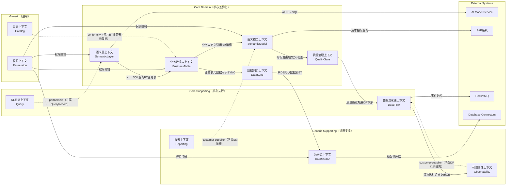

**Context 关系说明：**

| Context A → Context B | Relationship | Rationale |
| --------------------- | ------------ | ---------- |
| 数据同步上下文 → 数据源上下文 | Customer-Supplier | 同步任务从数据源读取数据并同步到业务表 |
| 数据源上下文 → 外部数据库 | ACL | 数据源上下文隔离外部数据库，在infrastructure层实现适配器 |
| 业务数据表上下文 ← 语义层上下文 | Customer-Supplier | NL→SQL查询业务数据表，不直接查询数据源 |
| 业务数据表上下文 → 语义模型上下文 | Customer-Supplier | 业务表引用语义模型的指标定义 |
| 语义模型上下文 → 质量治理上下文 | Customer-Supplier | 指标变更后需要触发质量检查 |
| 质量治理上下文 → 数据流水线上下文 | Customer-Supplier | 质量通过后自动触发下游流程执行 |
| 数据流水线上下文 → 可观测性上下文 | Customer-Supplier | 流程执行结果需要记录到监控日志 |
| NL查询上下文 ↔ 语义层上下文 | Partnership | 共享QueryRecord实体，协同完成NL→SQL查询 |
| 权限上下文 → 所有数据上下文 | ACL (Anti-Corruption Layer) | 权限上下文作为横向切面，横切所有数据访问 |
| 报表上下文 → 语义模型上下文 | Customer-Supplier | 报表消费语义模型的指标定义 |
| 目录上下文 → 业务数据表上下文 | Conformist | 目录使用业务数据表的元数据信息 |

---

## 5. Entities

### 5.1 Entity Overview

| Entity | Package | Identity Field | Key Attributes | Behaviors | Lifecycle States |
| ------ | ------- | -------------- | -------------- | --------- | ---------------- |
| `BusinessTable` | `entity` | `id` | name, datasourceId, status, currentVersion | define, updateVersion, addColumn, syncData | DRAFT, ACTIVE, SYNCING, DEPRECATED |
| `BusinessTableColumn` | `entity` | `id` | tableId, columnName, dataType, sourceColumn, mappingConfig | create, update, setDefaultValue | ACTIVE, INACTIVE |
| `BusinessTableVersion` | `entity` | `id` | tableId, version, columnSchema, changeLog | create, rollback | — |
| `DataSyncTask` | `entity` | `id` | taskName, sourceTableId, targetTableId, syncType, schedule, status | configure, execute, pause, resume | DRAFT, ACTIVE, PAUSED, ERROR |
| `DataSyncRecord` | `entity` | `id` | taskId, startTime, endTime, syncedRows, failedRows, status | create, complete, fail | — |
| `SyncConflictLog` | `entity` | `id` | taskId, recordKey, conflictType, sourceValue, targetValue, resolution | create, resolve | UNRESOLVED, RESOLVED |
| `DataFlow` | `entity` | `id` | name, status, dslConfig, datasourceId, ownerId | createFlow, updateFlow, execute, pause, archive | DRAFT, ACTIVE, PAUSED, ARCHIVED |
| `FlowLayer` | `entity` | `id` | flowId, layerOrder, layerType, config, status | execute, validate, rollback | PENDING, RUNNING, SUCCESS, FAILED, BLOCKED |
| `SemanticLayer` | `entity` | `id` | name, type, config | processNLQuery, generateSQL, correctSQL, extractKnowledge | — |
| `QueryRecord` | `entity` | `id` | userId, queryText, sqlText, confidence, status, businessTableId | submit, confirm, correct | SUBMITTED, GENERATED, CONFIRMED, CORRECTED, EXECUTED |
| `TermMapping` | `entity` | `id` | datasourceId, businessTerm, databaseTable, databaseField | create, update, deactivate | ACTIVE, INACTIVE |
| `KnowledgeEntry` | `entity` | `id` | datasourceId, rulePattern, sqlTemplate, usageCount | create, apply, updateUsageCount | ACTIVE, ARCHIVED |
| `SemanticModel` | `entity` | `id` | name, ownerId, version | defineMetric, queryMetric, refreshDownstream | — |
| `MetricDefinition` | `entity` | `id` | modelId, name, formula, dimensions, status | define, update, deprecate | DRAFT, ACTIVE, DEPRECATED |
| `DimensionDefinition` | `entity` | `id` | modelId, name, hierarchy, levels | define, addLevel | ACTIVE |
| `QualityGate` | `entity` | `id` | flowId, layerId, threshold, status | check, pass, fail | IDLE, CHECKING, PASSED, FAILED |
| `QualityTestCase` | `entity` | `id` | datasourceId, testType, testRule, parameters | create, execute, getResult | ACTIVE, DISABLED |
| `QualityResult` | `entity` | `id` | testCaseId, flowId, layerId, score, details, executedAt | create, getScore, getViolations | — |
| `DataContract` | `entity` | `id` | datasourceId, tableName, producerId, consumerId, slaThreshold | create, sign, violate, checkCompliance | DRAFT, SIGNED, ACTIVE, VIOLATED |
| `DataSource` | `entity` | `id` | name, type, connectionParams, status | configure, testConnection, syncMetadata | CONFIGURED, CONNECTED, DISCONNECTED, ERROR |
| `TableMetadata` | `gateway` | `id` | datasourceId, tableName, schemaName, columns | sync, getColumns | SYNCED, OUTDATED |
| `ColumnMetadata` | `gateway` | `id` | tableId, columnName, dataType, description | — | — |
| `DataSourceConnection` | `gateway` | `id` | datasourceId, host, port, database, status | connect, disconnect, testHealth | CONNECTED, DISCONNECTED |
| `Permission` | `entity` | `id` | targetType, targetId, principalType, principalId | grant, revoke, checkAccess | — |
| `DataPermission` | `vo.permission` | — | permissionType, rowFilter, columnMask | — | — |

### 5.2 Inheritance Hierarchy

**QualityTestCase 继承体系（按测试类型不同）：**

```
AbstractQualityTestCase (abstract)
├── UniquenessTestCase     — 检查字段值唯一性（非空约束由父类实现）
├── NotNullTestCase        — 检查字段非空
├── ValidValuesTestCase    — 检查字段值在合法值列表内
├── ForeignKeyTestCase     — 检查外键关系完整性
└── CustomSQLTestCase     — 用户自定义SQL条件的测试
```

**Abstract Methods (每个子类实现不同的测试逻辑):**

| Method | UniquenessTest | NotNullTest | ValidValuesTest | ForeignKeyTest | CustomSQLTest |
| ------ | -------------- | ----------- | --------------- | -------------- | ------------- |
| `execute(tableData)` | COUNT(DISTINCT) = COUNT | COUNT(*) = COUNT(col) | value IN list | parent EXISTS | user SQL |
| `getViolations()` | duplicate values | null rows | invalid rows | orphan rows | custom result |

### Entity Detail: DataFlow

**Identity:** `id` (Long, auto-generated)

**Attributes:**

| Attribute | Type | Required | Description |
| --------- | ---- | -------- | ----------- |
| `id` | Long | YES | 主键 |
| `name` | String(128) | YES | 流程名称 |
| `description` | String(500) | NO | 流程描述 |
| `dslConfig` | DSLConfig | YES | DSL配置（YAML/JSON结构） |
| `datasourceId` | Long | YES | 关联的数据源ID |
| `ownerId` | String(64) | YES | 所有者用户ID |
| `status` | FlowStatus | YES | 流程状态 |
| `currentVersion` | Integer | YES | 当前版本号 |
| `qualityThreshold` | Integer | YES | 质量门禁阈值（0-100） |
| `createdAt` | LocalDateTime | YES | 创建时间 |
| `updatedAt` | LocalDateTime | YES | 更新时间 |

**Behaviors:**

| Method | Parameters | Returns | Business Rule |
| ------ | ---------- | ------- | ------------- |
| `createFlow()` | name, dslConfig, datasourceId | DataFlow | R01: 同一DataSource下名称唯一 |
| `updateFlow()` | newDslConfig | void | R01: 名称唯一性校验 |
| `execute()` | startLayer, mode | ExecutionResult | R02: 当前层质量必须通过 |
| `pause()` | — | void | 仅ACTIVE状态可暂停 |
| `archive()` | — | void | 归档后不可修改执行 |
| `validateDSL()` | dslConfig | ValidationResult | DSL语法和引用完整性校验 |

**State Machine:**

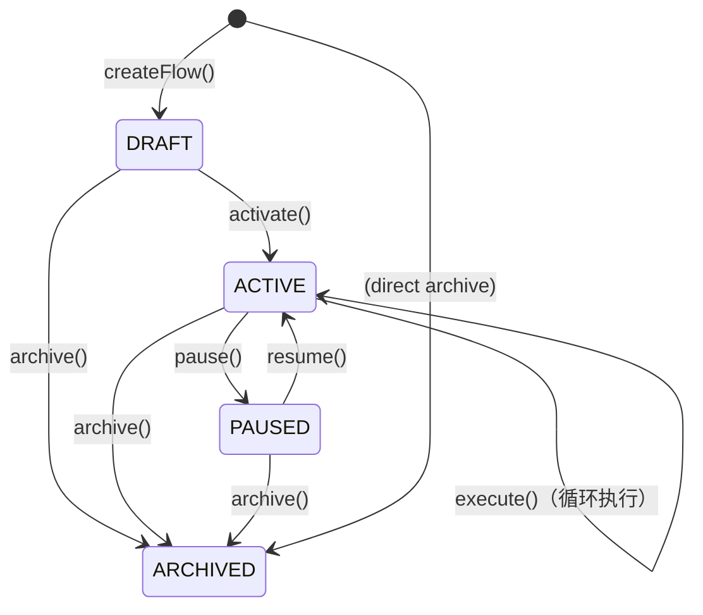

### Entity Detail: SemanticLayer

**Identity:** `id` (Long, auto-generated)

**Attributes:**

| Attribute | Type | Required | Description |
| --------- | ---- | -------- | ----------- |
| `id` | Long | YES | 主键 |
| `name` | String(64) | YES | 语义层名称 |
| `type` | SemanticLayerType | YES | QUERY / METRIC / KNOWLEDGE |
| `config` | Map | YES | 语义层配置 |
| `datasourceId` | Long | YES | 关联的数据源 |
| `confidenceThreshold` | Integer | YES | 置信度阈值（默认70） |
| `createdAt` | LocalDateTime | YES | 创建时间 |

**Behaviors:**

| Method | Parameters | Returns | Business Rule |
| ------ | ---------- | ------- | ------------- |
| `processNLQuery()` | queryText, userId | QueryRecord | 解析NL，生成SQL，记录QueryRecord |
| `generateSQL()` | queryRecord | SQLText | 结合TermMapping、KnowledgeEntry生成SQL |
| `correctSQL()` | queryId, correctedSQL, reason | void | R09: 校验SQL语法，更新记录 |
| `extractKnowledge()` | correctedSQL, reason | KnowledgeEntry | 从修正历史中提取规则 |
| `resolveAmbiguity()` | businessTerm, context | TermMapping | 使用知识图谱消解歧义 |
| `calculateConfidence()` | sqlText, usedMappings | ConfidenceScore | R05: 置信度0-100 |

### Entity Detail: QualityGate

**Identity:** `id` (Long, auto-generated)

**Attributes:**

| Attribute | Type | Required | Description |
| --------- | ---- | -------- | ----------- |
| `id` | Long | YES | 主键 |
| `flowId` | Long | YES | 关联的流程ID |
| `layerId` | Long | YES | 关联的层级ID |
| `threshold` | Integer | YES | 质量阈值（0-100） |
| `status` | QualityGateStatus | YES | 当前状态 |
| `lastCheckAt` | LocalDateTime | NO | 最近检查时间 |
| `lastScore` | QualityScore | NO | 最近一次评分 |

**Behaviors:**

| Method | Parameters | Returns | Business Rule |
| ------ | ---------- | ------- | ------------- |
| `check()` | layerExecutionResult | QualityResult | 执行内置测试用例，计算质量评分 |
| `pass()` | score | void | R02: score≥threshold才可通过 |
| `fail()` | score, violations | void | 记录违规项，触发告警和阻断 |
| `getViolatedRules()` | — | List<RuleViolation> | 获取未通过的质量规则列表 |

### Entity Detail: MetricDefinition

**Identity:** `id` (Long, auto-generated)

**Attributes:**

| Attribute | Type | Required | Description |
| --------- | ---- | -------- | ----------- |
| `id` | Long | YES | 主键 |
| `modelId` | Long | YES | 所属语义模型ID |
| `name` | String(128) | YES | 指标名称（如"收入"、"用户数"） |
| `displayName` | String(256) | YES | 显示名称 |
| `formula` | MetricFormula | YES | 指标计算公式 |
| `description` | String(500) | NO | 指标描述 |
| `dimensions` | List<DimensionRef> | NO | 关联的维度列表 |
| `status` | MetricStatus | YES | 状态 |
| `version` | Integer | YES | 版本号 |
| `createdAt` | LocalDateTime | YES | 创建时间 |
| `updatedAt` | LocalDateTime | YES | 更新时间 |

**Behaviors:**

| Method | Parameters | Returns | Business Rule |
| ------ | ---------- | ------- | ------------- |
| `define()` | name, formula, dimensions | MetricDefinition | R03: formula引用的字段必须存在 |
| `update()` | newFormula | void | 版本号+1，保留历史版本 |
| `deprecate()` | — | void | 标记为废弃，但不删除 |
| `getLatestValue()` | queryContext | BigDecimal | 查询最新指标值 |
| `getHistoricalValues()` | startDate, endDate | List<ValuePoint> | 获取历史数据 |

---

## 6. Value Objects

### 6.1 Gateway Value Objects (`domain.model.gateway`)

| Value Object | Attributes | Behaviors | Description |
| ------------ | ---------- | --------- | ----------- |
| `DatasourceType` | `code: String, name: String, jdbcDriver: String` | `getDefaultPort()`, `getJdbcUrlTemplate()` | 数据源类型枚举值对象 |
| `ConnectionParams` | `host: String, port: Integer, database: String, username: String, password: EncryptedString` | `getJdbcUrl()`, `validate()` | 数据源连接参数（密码加密存储） |
| `TableIdentity` | `datasourceId: Long, schemaName: String, tableName: String` | `toFullName()`, `equals()` | 表的全局身份标识 |
| `ColumnIdentity` | `tableIdentity: TableIdentity, columnName: String` | `toFullName()` | 列的全局身份标识 |

### 6.2 Semantic Value Objects (`domain.model.vo.semantic`)

| Value Object | Attributes | Behaviors | Description |
| ------------ | ---------- | --------- | ----------- |
| `BusinessTerm` | `term: String, alternativeTerms: List<String>, description: String` | `matches(input: String): boolean` | 业务术语，支持同义词匹配 |
| `MetricFormula` | `expression: String, referencedFields: List<ColumnIdentity>, aggregationType: AggregationType` | `validate()`, `toSQL(dimensions)`, `getReferencedTables()` | 指标计算公式 |
| `DimensionLevel` | `name: String, level: Integer, parentLevel: DimensionLevel, defaultSelection: String` | `getHierarchy(): List<DimensionLevel>` | 维度层级（如地区>城市>门店） |
| `ConfidenceScore` | `value: Integer(0-100), factors: Map<String, Integer>` | `isAboveThreshold(threshold): boolean`, R05 | SQL置信度评分 |
| `QualityScore` | `value: Integer(0-100), details: Map<TestType, Integer>` | `getGrade(): QualityGrade`, R06 | 质量评分，支持分项明细 |

### 6.3 Data Flow Value Objects (`domain.model.vo.flow`)

| Value Object | Attributes | Behaviors | Description |
| ------------ | ---------- | --------- | ----------- |
| `DSLConfig` | `yamlContent: String, version: String` | `parse()`, `validate()`, `toJson()` | 流程的DSL配置 |
| `FlowNodeConfig` | `nodeType: NodeType, parameters: Map<String, Object>, nextNodes: List<String>` | `validate()` | 流程节点配置 |
| `ExecutionResult` | `layerId: Long, status: LayerStatus, inputRows: Long, outputRows: Long, durationMs: Long, errorMessage: String` | `isSuccess(): boolean` | 层级执行结果 |

### 6.4 Permission Value Objects (`domain.model.vo.permission`)

| Value Object | Attributes | Behaviors | Description |
| ------------ | ---------- | --------- | ----------- |
| `DataPermission` | `permissionType: PermissionType, rowFilter: RowFilter, columnMask: ColumnMask` | `applyTo(query): ModifiedQuery` | 数据权限（行级+列级） |
| `RowFilter` | `condition: String, parameters: Map<String, Object>` | `applyTo(table)`, `validate()` | 行级过滤条件 |
| `ColumnMask` | `columnName: String, maskType: MaskType, maskPattern: String` | `applyTo(value): String` | 列级脱敏规则 |

---

## 7. Aggregates

### Aggregate: SemanticLayerAggregate

| Property | Value |
| -------- | ----- |
| Aggregate Root | `SemanticLayer` |
| Child Entities | `QueryRecord`, `TermMapping`, `KnowledgeEntry` |
| Value Objects | `ConfidenceScore`, `BusinessTerm`, `SQLText` |
| Repository | `SemanticLayerRepository` |

**Invariants:**

| Rule ID | Description |
| ------- | ----------- |
| R01 | 同一语义层下，TermMapping的businessTerm不允许重复 |
| R05 | ConfidenceScore必须在0-100之间 |
| R08 | TermMapping的businessTerm和databaseField组合必须唯一 |
| R09 | CorrectSQL时，修正后的SQL必须通过语法校验 |

**Access Rules:**
- External access only through `SemanticLayer`
- QueryRecord、TermMapping、KnowledgeEntry只能通过SemanticLayer的方法修改
- 跨聚合引用使用ID

### Aggregate: DataFlowAggregate

| Property | Value |
| -------- | ----- |
| Aggregate Root | `DataFlow` |
| Child Entities | `FlowLayer`, `FlowVersion` |
| Value Objects | `DSLConfig`, `ExecutionResult`, `QualityScore` |
| Repository | `DataFlowRepository` |

**Invariants:**

| Rule ID | Description |
| ------- | ----------- |
| R01 | 同一DataSource下，DataFlow的name不允许重复 |
| R02 | FlowLayer执行时，前一层QualityScore必须≥threshold |
| R07 | FlowLayer的layerOrder必须递增连续 |

**Access Rules:**
- External access only through `DataFlow`
- FlowLayer只能通过DataFlow.execute()或DataFlow.addLayer()修改
- 跨聚合引用使用ID

### Aggregate: QualityGateAggregate

| Property | Value |
| -------- | ----- |
| Aggregate Root | `QualityGate` |
| Child Entities | `QualityTestCase`, `QualityResult`, `DataContract` |
| Value Objects | `QualityScore`, `QualityGrade` |
| Repository | `QualityGateRepository` |

**Invariants:**

| Rule ID | Description |
| ------- | ----------- |
| R02 | QualityScore < threshold时，必须阻断流程 |
| R06 | QualityScore必须在0-100之间 |
| R10 | DataContract的slaThreshold必须在0-100之间 |

**Access Rules:**
- External access only through `QualityGate`
- DataContract的签订和违反必须通过QualityGate处理

### Aggregate: SemanticModelAggregate

| Property | Value |
| -------- | ----- |
| Aggregate Root | `SemanticModel` |
| Child Entities | `MetricDefinition`, `DimensionDefinition` |
| Value Objects | `MetricFormula`, `DimensionLevel` |
| Repository | `SemanticModelRepository` |

**Invariants:**

| Rule ID | Description |
| ------- | ----------- |
| R03 | MetricDefinition.formula引用的字段必须在对应DataSource中存在 |
| MetricDefinition.name在同一个SemanticModel内必须唯一 |

**Access Rules:**
- External access only through `SemanticModel`
- MetricDefinition和DimensionDefinition只能通过SemanticModel的方法修改

---

## 8. Entity Relationships

| From | To | Relationship | Multiplicity | Cross-Aggregate |
| ---- | --- | ------------ | ------------ | --------------- |
| BusinessTable | BusinessTableColumn | Composition | 1:N | No（同一聚合） |
| BusinessTable | BusinessTableVersion | Composition | 1:N | No（同一聚合） |
| DataSyncTask | DataSyncRecord | Composition | 1:N | No（同一聚合） |
| DataSyncTask | SyncConflictLog | Composition | 1:N | No（同一聚合） |
| DataSyncTask | BusinessTable | Reference by ID | N:1 | Yes（目标业务表） |
| DataSyncTask | TableMetadata | Reference by ID | N:1 | Yes（源数据表） |
| DataFlow | FlowLayer | Composition | 1:N | No（同一聚合） |
| DataFlow | FlowVersion | Composition | 1:N | No（同一聚合） |
| SemanticLayer | QueryRecord | Composition | 1:N | No（同一聚合） |
| SemanticLayer | TermMapping | Composition | 1:N | No（同一聚合） |
| SemanticLayer | KnowledgeEntry | Composition | 1:N | No（同一聚合） |
| SemanticLayer | BusinessTable | Reference by ID | N:1 | Yes（查询业务表，非源数据源） |
| QualityGate | QualityTestCase | Association | 1:N | No（同一聚合） |
| QualityGate | QualityResult | Composition | 1:N | No（同一聚合） |
| SemanticModel | MetricDefinition | Composition | 1:N | No（同一聚合） |
| SemanticModel | DimensionDefinition | Composition | 1:N | No（同一聚合） |
| DataSource | TableMetadata | Association | 1:N | Yes |
| TableMetadata | ColumnMetadata | Composition | 1:N | No（同一聚合） |
| DataFlow | DataSource | Reference by ID | N:1 | Yes |
| SemanticModel | DataSource | Reference by ID | N:1 | Yes |
| QualityGate | DataFlow | Reference by ID | N:1 | Yes |
| MetricDefinition | DimensionDefinition | Reference by ID | N:M | Yes |
| Permission | BusinessTable/DataFlow/MetricDefinition | Reference by ID | N:1 | Yes |

---

## 9. ER Diagram

```mermaid
erDiagram
    %% ========== Aggregate: BusinessTable ==========
    BusinessTable ||--o{ BusinessTableColumn : "contains"
    BusinessTable ||--o{ BusinessTableVersion : "contains"

    BusinessTable {
        long id PK
        string name UK
        long datasourceId FK
        string status
        int currentVersion
        datetime createdAt
        datetime updatedAt
    }

    BusinessTableColumn {
        long id PK
        long businessTableId FK
        string columnName
        string dataType
        string sourceColumn
        string mappingConfig
        string status
    }

    BusinessTableVersion {
        long id PK
        long businessTableId FK
        int version
        string columnSchema
        string changeLog
        datetime createdAt
    }

    %% ========== Aggregate: DataSyncTask ==========
    DataSyncTask ||--o{ DataSyncRecord : "contains"
    DataSyncTask ||--o{ SyncConflictLog : "contains"
    DataSyncTask }o..|| BusinessTable : "target"
    DataSyncTask }o..|| TableMetadata : "source"

    DataSyncTask {
        long id PK
        string taskName
        long sourceTableId FK
        long targetTableId FK
        string syncType
        string schedule
        string status
        datetime createdAt
    }

    DataSyncRecord {
        long id PK
        long syncTaskId FK
        datetime startTime
        datetime endTime
        long syncedRows
        long failedRows
        string status
    }

    SyncConflictLog {
        long id PK
        long syncTaskId FK
        string recordKey
        string conflictType
        string sourceValue
        string targetValue
        string resolution
        datetime createdAt
    }

    %% ========== Aggregate: SemanticLayer ==========
    SemanticLayer ||--o{ QueryRecord : "contains"
    SemanticLayer ||--o{ TermMapping : "contains"
    SemanticLayer ||--o{ KnowledgeEntry : "contains"

    SemanticLayer {
        long id PK
        string name UK
        string type
        int confidenceThreshold
        long datasourceId FK
        datetime createdAt
    }

    QueryRecord {
        long id PK
        long semanticLayerId FK
        string userId
        string queryText
        string sqlText
        long businessTableId FK
        int confidence
        string status
        datetime createdAt
    }

    TermMapping {
        long id PK
        long semanticLayerId FK
        string businessTerm
        string databaseTable
        string databaseField
        string status
        datetime createdAt
    }

    KnowledgeEntry {
        long id PK
        long semanticLayerId FK
        string rulePattern
        string sqlTemplate
        int usageCount
        string status
        datetime createdAt
    }

    %% ========== Aggregate: DataFlow ==========
    DataFlow ||--o{ FlowLayer : "contains"
    DataFlow ||--o{ FlowVersion : "contains"

    DataFlow {
        long id PK
        string name UK
        string description
        string dslConfig
        long datasourceId FK
        string ownerId
        string status
        int currentVersion
        int qualityThreshold
        datetime createdAt
        datetime updatedAt
    }

    FlowLayer {
        long id PK
        long dataFlowId FK
        int layerOrder
        string layerType
        string config
        string status
        datetime createdAt
    }

    FlowVersion {
        long id PK
        long dataFlowId FK
        int version
        string dslConfig
        string changeLog
        datetime createdAt
    }

    %% ========== Aggregate: QualityGate ==========
    QualityGate ||--o{ QualityTestCase : "associates"
    QualityGate ||--o{ QualityResult : "contains"
    QualityGate ||--o{ DataContract : "contains"

    QualityGate {
        long id PK
        long flowId FK
        long layerId FK
        int threshold
        string status
        datetime lastCheckAt
    }

    QualityTestCase {
        long id PK
        long qualityGateId FK
        string testType
        string testRule
        string parameters
        string status
    }

    QualityResult {
        long id PK
        long qualityGateId FK
        long testCaseId FK
        long flowId FK
        long layerId FK
        int score
        string details
        datetime executedAt
    }

    DataContract {
        long id PK
        long qualityGateId FK
        long datasourceId FK
        string tableName
        string producerId
        string consumerId
        int slaThreshold
        string status
        datetime createdAt
    }

    %% ========== Aggregate: SemanticModel ==========
    SemanticModel ||--o{ MetricDefinition : "contains"
    SemanticModel ||--o{ DimensionDefinition : "contains"

    SemanticModel {
        long id PK
        string name
        string ownerId
        int version
        datetime createdAt
    }

    MetricDefinition {
        long id PK
        long semanticModelId FK
        string name
        string displayName
        string formula
        string description
        string status
        int version
        datetime createdAt
        datetime updatedAt
    }

    DimensionDefinition {
        long id PK
        long semanticModelId FK
        string name
        string hierarchy
        string levels
        string status
    }

    %% ========== Aggregate: DataSource ==========
    DataSource ||--o{ TableMetadata : "has"
    DataSource ||--o{ DataSourceConnection : "manages"

    DataSource {
        long id PK
        string name
        string type
        string connectionParams
        string status
        datetime createdAt
        datetime updatedAt
    }

    TableMetadata {
        long id PK
        long datasourceId FK
        string schemaName
        string tableName
        string status
        datetime syncedAt
    }

    ColumnMetadata {
        long id PK
        long tableMetadataId FK
        string columnName
        string dataType
        string description
    }

    DataSourceConnection {
        long id PK
        long datasourceId FK
        string host
        int port
        string database
        string status
        datetime lastConnectedAt
    }

    %% ========== Aggregate: Permission ==========
    Permission ||--o{ DataPermission : "embeds"

    Permission {
        long id PK
        string targetType
        long targetId
        string principalType
        string principalId
        string permissionType
        datetime createdAt
    }

    %% ========== Cross-Aggregate References ==========
    DataSource }o..|| DataFlow : "FK: datasourceId"
    DataSource }o..|| SemanticLayer : "FK: datasourceId"
    DataSource }o..|| SemanticModel : "FK: datasourceId"
    DataFlow }o..|| QualityGate : "FK: flowId"
```

---

## 10. Database Schema Design（数据库表设计）

### 10.1 Entity → Table Mapping（领域模型 → 表映射）

| Domain Type (Section 5/6) | Type | Table Name | Mapping Strategy |
| ------------------------- | ---- | ---------- | ---------------- |
| `DataFlow` | Aggregate Root | `t_data_flow` | One-to-one |
| `FlowLayer` | Child Entity | `t_flow_layer` | One-to-one, FK → `t_data_flow` |
| `FlowVersion` | Child Entity | `t_flow_version` | One-to-one, FK → `t_data_flow` |
| `SemanticLayer` | Aggregate Root | `t_semantic_layer` | One-to-one |
| `QueryRecord` | Child Entity | `t_query_record` | One-to-one, FK → `t_semantic_layer` |
| `TermMapping` | Child Entity | `t_term_mapping` | One-to-one, FK → `t_semantic_layer` |
| `KnowledgeEntry` | Child Entity | `t_knowledge_entry` | One-to-one, FK → `t_semantic_layer` |
| `QualityGate` | Aggregate Root | `t_quality_gate` | One-to-one |
| `QualityTestCase` | Child Entity | `t_quality_test_case` | One-to-one, FK → `t_quality_gate` |
| `QualityResult` | Child Entity | `t_quality_result` | One-to-one, FK → `t_quality_gate` |
| `DataContract` | Child Entity | `t_data_contract` | One-to-one, FK → `t_quality_gate` |
| `SemanticModel` | Aggregate Root | `t_semantic_model` | One-to-one |
| `MetricDefinition` | Child Entity | `t_metric_definition` | One-to-one, FK → `t_semantic_model` |
| `DimensionDefinition` | Child Entity | `t_dimension_definition` | One-to-one, FK → `t_semantic_model` |
| `DataSource` | Aggregate Root | `t_data_source` | One-to-one |
| `TableMetadata` | Child Entity | `t_table_metadata` | One-to-one, FK → `t_data_source` |
| `ColumnMetadata` | Child Entity | `t_column_metadata` | One-to-one, FK → `t_table_metadata` |
| `DataSourceConnection` | Child Entity | `t_datasource_connection` | One-to-one, FK → `t_data_source` |
| `Permission` | Aggregate Root | `t_permission` | One-to-one |
| `ConfidenceScore` | Value Object | —（嵌入 `t_query_record`） | Embedded (列展开) |
| `QualityScore` | Value Object | —（嵌入 `t_quality_result`） | Embedded (列展开) |
| `DSLConfig` | Value Object | —（嵌入 `t_data_flow`） | Embedded (TEXT/JSON列) |
| `MetricFormula` | Value Object | —（嵌入 `t_metric_definition`） | Embedded (TEXT列) |

### 10.2 Table Overview（表总览）

| # | Table Name | Description | Primary Key | Related Aggregate |
| - | ---------- | ----------- | ----------- | ---------------- |
| 1 | `t_data_flow` | 数据流程主表 | `id` (BIGINT) | DataFlowAggregate |
| 2 | `t_flow_layer` | 流程层级表 | `id` (BIGINT) | DataFlowAggregate |
| 3 | `t_flow_version` | 流程版本历史表 | `id` (BIGINT) | DataFlowAggregate |
| 4 | `t_semantic_layer` | 语义层主表 | `id` (BIGINT) | SemanticLayerAggregate |
| 5 | `t_query_record` | 查询记录表 | `id` (BIGINT) | SemanticLayerAggregate |
| 6 | `t_term_mapping` | 术语映射表 | `id` (BIGINT) | SemanticLayerAggregate |
| 7 | `t_knowledge_entry` | 知识条目表 | `id` (BIGINT) | SemanticLayerAggregate |
| 8 | `t_quality_gate` | 质量门禁表 | `id` (BIGINT) | QualityGateAggregate |
| 9 | `t_quality_test_case` | 质量测试用例表 | `id` (BIGINT) | QualityGateAggregate |
| 10 | `t_quality_result` | 质量结果表 | `id` (BIGINT) | QualityGateAggregate |
| 11 | `t_data_contract` | 数据契约表 | `id` (BIGINT) | QualityGateAggregate |
| 12 | `t_semantic_model` | 语义模型主表 | `id` (BIGINT) | SemanticModelAggregate |
| 13 | `t_metric_definition` | 指标定义表 | `id` (BIGINT) | SemanticModelAggregate |
| 14 | `t_dimension_definition` | 维度定义表 | `id` (BIGINT) | SemanticModelAggregate |
| 15 | `t_data_source` | 数据源配置表 | `id` (BIGINT) | DataSourceAggregate |
| 16 | `t_table_metadata` | 表元数据表 | `id` (BIGINT) | DataSourceAggregate |
| 17 | `t_column_metadata` | 列元数据表 | `id` (BIGINT) | DataSourceAggregate |
| 18 | `t_datasource_connection` | 数据源连接表 | `id` (BIGINT) | DataSourceAggregate |
| 19 | `t_permission` | 权限表 | `id` (BIGINT) | PermissionAggregate |

### 10.3 Table Detail（表详情）

#### Table: `t_data_flow`

| # | Column | Type | Nullable | Default | Domain Field | Description |
| - | ------ | ---- | -------- | ------- | ------------ | ----------- |
| 1 | `id` | BIGINT | NO | AUTO_INCR | — | 主键 |
| 2 | `name` | VARCHAR(128) | NO | | `name` | 流程名称 |
| 3 | `description` | VARCHAR(500) | YES | | `description` | 流程描述 |
| 4 | `dsl_config` | TEXT | NO | | `dslConfig` | DSL配置（YAML/JSON） |
| 5 | `datasource_id` | BIGINT | NO | | `datasourceId` | 关联数据源ID |
| 6 | `owner_id` | VARCHAR(64) | NO | | `ownerId` | 所有者用户ID |
| 7 | `status` | VARCHAR(32) | NO | | `status` | 流程状态 |
| 8 | `current_version` | INT | NO | 1 | `currentVersion` | 当前版本号 |
| 9 | `quality_threshold` | INT | NO | 70 | `qualityThreshold` | 质量门禁阈值 |
| 10 | `created_by` | VARCHAR(64) | YES | | | 创建人 |
| 11 | `created_at` | DATETIME | NO | CURRENT_TIME | | 创建时间 |
| 12 | `updated_by` | VARCHAR(64) | YES | | | 修改人 |
| 13 | `updated_at` | DATETIME | NO | CURRENT_TIME | | 修改时间 |
| 14 | `is_deleted` | TINYINT(1) | NO | 0 | | 逻辑删除 |

**Indexes:**

| Index Name | Columns | Type | Description |
| ---------- | ------- | ---- | ----------- |
| `uk_datasource_flow_name` | `datasource_id`, `name`, `is_deleted` | UNIQUE | 同一数据源下名称唯一 |
| `idx_owner_id` | `owner_id` | NORMAL | 按所有者查询 |
| `idx_status` | `status` | NORMAL | 按状态查询 |

#### Table: `t_flow_layer`

| # | Column | Type | Nullable | Default | Domain Field | Description |
| - | ------ | ---- | -------- | ------- | ------------ | ----------- |
| 1 | `id` | BIGINT | NO | AUTO_INCR | — | 主键 |
| 2 | `data_flow_id` | BIGINT | NO | | `flowId` | 关联流程ID |
| 3 | `layer_order` | INT | NO | | `layerOrder` | 层顺序号 |
| 4 | `layer_type` | VARCHAR(64) | NO | | `layerType` | 层类型（EXTRACT/TRANSFORM/LOAD） |
| 5 | `config` | TEXT | YES | | `config` | 层配置参数 |
| 6 | `status` | VARCHAR(32) | NO | | `status` | 层状态 |
| 7 | `created_at` | DATETIME | NO | CURRENT_TIME | | 创建时间 |

**Indexes:**

| Index Name | Columns | Type | Description |
| ---------- | ------- | ---- | ----------- |
| `idx_data_flow_id` | `data_flow_id` | NORMAL | 外键索引 |
| `uk_flow_layer_order` | `data_flow_id`, `layer_order`, `is_deleted` | UNIQUE | 同一流程内层顺序唯一 |

**Foreign Keys:**

| FK Name | Column | References |
| ------- | ------ | ---------- |
| `fk_layer_flow` | `data_flow_id` | `t_data_flow(id)` |

#### Table: `t_semantic_layer`

| # | Column | Type | Nullable | Default | Domain Field | Description |
| - | ------ | ---- | -------- | ------- | ------------ | ----------- |
| 1 | `id` | BIGINT | NO | AUTO_INCR | — | 主键 |
| 2 | `name` | VARCHAR(64) | NO | | `name` | 语义层名称 |
| 3 | `type` | VARCHAR(32) | NO | | `type` | 类型（QUERY/METRIC/KNOWLEDGE） |
| 4 | `config` | TEXT | YES | | `config` | 语义层配置 |
| 5 | `datasource_id` | BIGINT | NO | | `datasourceId` | 关联数据源ID |
| 6 | `confidence_threshold` | INT | NO | 70 | `confidenceThreshold` | 置信度阈值 |
| 7 | `created_by` | VARCHAR(64) | YES | | | 创建人 |
| 8 | `created_at` | DATETIME | NO | CURRENT_TIME | | 创建时间 |
| 9 | `is_deleted` | TINYINT(1) | NO | 0 | | 逻辑删除 |

**Indexes:**

| Index Name | Columns | Type | Description |
| ---------- | ------- | ---- | ----------- |
| `uk_datasource_semantic_name` | `datasource_id`, `name`, `is_deleted` | UNIQUE | 同一数据源下名称唯一 |
| `idx_type` | `type` | NORMAL | 按类型查询 |

#### Table: `t_query_record`

| # | Column | Type | Nullable | Default | Domain Field | Description |
| - | ------ | ---- | -------- | ------- | ------------ | ----------- |
| 1 | `id` | BIGINT | NO | AUTO_INCR | — | 主键 |
| 2 | `semantic_layer_id` | BIGINT | NO | | `semanticLayerId` | 关联语义层ID |
| 3 | `user_id` | VARCHAR(64) | NO | | `userId` | 用户ID |
| 4 | `query_text` | VARCHAR(2000) | NO | | `queryText` | 自然语言查询文本 |
| 5 | `sql_text` | TEXT | YES | | `sqlText` | 生成的SQL文本 |
| 6 | `confidence` | INT | YES | | `confidence` | 置信度评分（0-100） |
| 7 | `status` | VARCHAR(32) | NO | | `status` | 查询状态 |
| 8 | `corrected_sql` | TEXT | YES | | `correctedSql` | 用户修正的SQL |
| 9 | `correction_reason` | VARCHAR(500) | YES | | `correctionReason` | 修正原因 |
| 10 | `used_tables` | VARCHAR(500) | YES | | `usedTables` | 使用的表（逗号分隔） |
| 11 | `used_mappings` | VARCHAR(1000) | YES | | `usedMappings` | 使用的术语映射 |
| 12 | `created_at` | DATETIME | NO | CURRENT_TIME | | 创建时间 |
| 13 | `updated_at` | DATETIME | NO | CURRENT_TIME | | 更新时间 |

**Indexes:**

| Index Name | Columns | Type | Description |
| ---------- | ------- | ---- | ----------- |
| `idx_semantic_layer_id` | `semantic_layer_id` | NORMAL | 外键索引 |
| `idx_user_id` | `user_id` | NORMAL | 按用户查询 |
| `idx_created_at` | `created_at` | NORMAL | 按时间查询 |

#### Table: `t_term_mapping`

| # | Column | Type | Nullable | Default | Domain Field | Description |
| - | ------ | ---- | -------- | ------- | ------------ | ----------- |
| 1 | `id` | BIGINT | NO | AUTO_INCR | — | 主键 |
| 2 | `semantic_layer_id` | BIGINT | NO | | `semanticLayerId` | 关联语义层ID |
| 3 | `business_term` | VARCHAR(128) | NO | | `businessTerm` | 业务术语 |
| 4 | `database_table` | VARCHAR(128) | NO | | `databaseTable` | 数据库表名 |
| 5 | `database_field` | VARCHAR(128) | NO | | `databaseField` | 数据库字段名 |
| 6 | `alternative_terms` | VARCHAR(500) | YES | | `alternativeTerms` | 同义词（逗号分隔） |
| 7 | `description` | VARCHAR(500) | YES | | `description` | 术语描述 |
| 8 | `status` | VARCHAR(32) | NO | ACTIVE | `status` | 状态 |
| 9 | `version` | INT | NO | 1 | `version` | 版本号 |
| 10 | `created_at` | DATETIME | NO | CURRENT_TIME | | 创建时间 |
| 11 | `updated_at` | DATETIME | NO | CURRENT_TIME | | 更新时间 |

**Indexes:**

| Index Name | Columns | Type | Description |
| ---------- | ------- | ---- | ----------- |
| `uk_semantic_business_term` | `semantic_layer_id`, `business_term`, `status` | UNIQUE | 同一语义层内业务术语唯一 |
| `idx_database_table_field` | `database_table`, `database_field` | NORMAL | 按数据库字段反查 |

#### Table: `t_knowledge_entry`

| # | Column | Type | Nullable | Default | Domain Field | Description |
| - | ------ | ---- | -------- | ------- | ------------ | ----------- |
| 1 | `id` | BIGINT | NO | AUTO_INCR | — | 主键 |
| 2 | `semantic_layer_id` | BIGINT | NO | | `semanticLayerId` | 关联语义层ID |
| 3 | `rule_pattern` | VARCHAR(500) | NO | | `rulePattern` | 规则模式（正则或SQL片段） |
| 4 | `sql_template` | TEXT | NO | | `sqlTemplate` | SQL模板 |
| 5 | `description` | VARCHAR(500) | YES | | `description` | 规则描述 |
| 6 | `usage_count` | INT | NO | 0 | `usageCount` | 使用次数 |
| 7 | `last_used_at` | DATETIME | YES | | `lastUsedAt` | 最后使用时间 |
| 8 | `status` | VARCHAR(32) | NO | ACTIVE | `status` | 状态 |
| 9 | `created_at` | DATETIME | NO | CURRENT_TIME | | 创建时间 |

**Indexes:**

| Index Name | Columns | Type | Description |
| ---------- | ------- | ---- | ----------- |
| `idx_semantic_layer_id` | `semantic_layer_id` | NORMAL | 外键索引 |
| `idx_rule_pattern` | `rule_pattern` | NORMAL | 按规则模式查询 |
| `idx_usage_count` | `usage_count` | NORMAL | 按使用次数排序 |

#### Table: `t_quality_gate`

| # | Column | Type | Nullable | Default | Domain Field | Description |
| - | ------ | ---- | -------- | ------- | ------------ | ----------- |
| 1 | `id` | BIGINT | NO | AUTO_INCR | — | 主键 |
| 2 | `flow_id` | BIGINT | NO | | `flowId` | 关联流程ID |
| 3 | `layer_id` | BIGINT | NO | | `layerId` | 关联层级ID |
| 4 | `threshold` | INT | NO | 70 | `threshold` | 质量阈值 |
| 5 | `status` | VARCHAR(32) | NO | | `status` | 门禁状态 |
| 6 | `last_check_at` | DATETIME | YES | | `lastCheckAt` | 最近检查时间 |
| 7 | `last_score` | INT | YES | | `lastScore` | 最近一次评分 |
| 8 | `created_at` | DATETIME | NO | CURRENT_TIME | | 创建时间 |
| 9 | `is_deleted` | TINYINT(1) | NO | 0 | | 逻辑删除 |

**Indexes:**

| Index Name | Columns | Type | Description |
| ---------- | ------- | ---- | ----------- |
| `uk_flow_layer` | `flow_id`, `layer_id`, `is_deleted` | UNIQUE | 流程+层级唯一 |
| `idx_status` | `status` | NORMAL | 按状态查询 |

#### Table: `t_quality_test_case`

| # | Column | Type | Nullable | Default | Domain Field | Description |
| - | ------ | ---- | -------- | ------- | ------------ | ----------- |
| 1 | `id` | BIGINT | NO | AUTO_INCR | — | 主键 |
| 2 | `quality_gate_id` | BIGINT | NO | | `qualityGateId` | 关联质量门禁ID |
| 3 | `test_type` | VARCHAR(64) | NO | | `testType` | 测试类型（UNIQUENESS/NOT_NULL/VALID_VALUES/FOREIGN_KEY/CUSTOM_SQL） |
| 4 | `test_rule` | VARCHAR(500) | NO | | `testRule` | 测试规则描述 |
| 5 | `parameters` | TEXT | YES | | `parameters` | 测试参数（JSON格式） |
| 6 | `status` | VARCHAR(32) | NO | ACTIVE | `status` | 状态 |
| 7 | `created_at` | DATETIME | NO | CURRENT_TIME | | 创建时间 |

**Indexes:**

| Index Name | Columns | Type | Description |
| ---------- | ------- | ---- | ----------- |
| `idx_quality_gate_id` | `quality_gate_id` | NORMAL | 外键索引 |
| `idx_test_type` | `test_type` | NORMAL | 按测试类型查询 |

#### Table: `t_quality_result`

| # | Column | Type | Nullable | Default | Domain Field | Description |
| - | ------ | ---- | -------- | ------- | ------------ | ----------- |
| 1 | `id` | BIGINT | NO | AUTO_INCR | — | 主键 |
| 2 | `quality_gate_id` | BIGINT | NO | | `qualityGateId` | 关联质量门禁ID |
| 3 | `test_case_id` | BIGINT | YES | | `testCaseId` | 关联测试用例ID |
| 4 | `flow_id` | BIGINT | NO | | `flowId` | 关联流程ID |
| 5 | `layer_id` | BIGINT | NO | | `layerId` | 关联层级ID |
| 6 | `score` | INT | NO | | `score` | 质量评分（0-100） |
| 7 | `details` | TEXT | YES | | `details` | 评分明细（JSON格式） |
| 8 | `violations` | TEXT | YES | | `violations` | 违规详情（JSON格式） |
| 9 | `executed_at` | DATETIME | NO | CURRENT_TIME | | 执行时间 |

**Indexes:**

| Index Name | Columns | Type | Description |
| ---------- | ------- | ---- | ----------- |
| `idx_quality_gate_id` | `quality_gate_id` | NORMAL | 外键索引 |
| `idx_flow_layer` | `flow_id`, `layer_id` | NORMAL | 按流程层级查询 |
| `idx_executed_at` | `executed_at` | NORMAL | 按执行时间查询 |

#### Table: `t_data_contract`

| # | Column | Type | Nullable | Default | Domain Field | Description |
| - | ------ | ---- | -------- | ------- | ------------ | ----------- |
| 1 | `id` | BIGINT | NO | AUTO_INCR | — | 主键 |
| 2 | `quality_gate_id` | BIGINT | NO | | `qualityGateId` | 关联质量门禁ID |
| 3 | `datasource_id` | BIGINT | NO | | `datasourceId` | 关联数据源ID |
| 4 | `table_name` | VARCHAR(128) | NO | | `tableName` | 目标表名 |
| 5 | `producer_id` | VARCHAR(64) | NO | | `producerId` | 供应方ID |
| 6 | `consumer_id` | VARCHAR(64) | NO | | `consumerId` | 消费方ID |
| 7 | `sla_threshold` | INT | NO | 80 | `slaThreshold` | SLA阈值 |
| 8 | `contract_rules` | TEXT | YES | | `contractRules` | 契约规则（JSON格式） |
| 9 | `status` | VARCHAR(32) | NO | | `status` | 状态 |
| 10 | `signed_at` | DATETIME | YES | | `signedAt` | 签订时间 |
| 11 | `created_at` | DATETIME | NO | CURRENT_TIME | | 创建时间 |

**Indexes:**

| Index Name | Columns | Type | Description |
| ---------- | ------- | ---- | ----------- |
| `idx_datasource_table` | `datasource_id`, `table_name` | NORMAL | 按数据源表查询 |
| `idx_producer_consumer` | `producer_id`, `consumer_id` | NORMAL | 按供应方消费方查询 |

#### Table: `t_semantic_model`

| # | Column | Type | Nullable | Default | Domain Field | Description |
| - | ------ | ---- | -------- | ------- | ------------ | ----------- |
| 1 | `id` | BIGINT | NO | AUTO_INCR | — | 主键 |
| 2 | `name` | VARCHAR(128) | NO | | `name` | 模型名称 |
| 3 | `owner_id` | VARCHAR(64) | NO | | `ownerId` | 所有者ID |
| 4 | `description` | VARCHAR(500) | YES | | `description` | 模型描述 |
| 5 | `version` | INT | NO | 1 | `version` | 版本号 |
| 6 | `created_by` | VARCHAR(64) | YES | | | 创建人 |
| 7 | `created_at` | DATETIME | NO | CURRENT_TIME | | 创建时间 |
| 8 | `updated_by` | VARCHAR(64) | YES | | | 修改人 |
| 9 | `updated_at` | DATETIME | NO | CURRENT_TIME | | 修改时间 |
| 10 | `is_deleted` | TINYINT(1) | NO | 0 | | 逻辑删除 |

**Indexes:**

| Index Name | Columns | Type | Description |
| ---------- | ------- | ---- | ----------- |
| `uk_name` | `name`, `is_deleted` | UNIQUE | 模型名称唯一 |
| `idx_owner_id` | `owner_id` | NORMAL | 按所有者查询 |

#### Table: `t_metric_definition`

| # | Column | Type | Nullable | Default | Domain Field | Description |
| - | ------ | ---- | -------- | ------- | ------------ | ----------- |
| 1 | `id` | BIGINT | NO | AUTO_INCR | — | 主键 |
| 2 | `semantic_model_id` | BIGINT | NO | | `modelId` | 关联语义模型ID |
| 3 | `name` | VARCHAR(128) | NO | | `name` | 指标名称 |
| 4 | `display_name` | VARCHAR(256) | NO | | `displayName` | 显示名称 |
| 5 | `formula` | TEXT | NO | | `formula` | 指标公式 |
| 6 | `description` | VARCHAR(500) | YES | | `description` | 指标描述 |
| 7 | `dimensions` | VARCHAR(500) | YES | | `dimensions` | 关联维度（JSON数组） |
| 8 | `status` | VARCHAR(32) | NO | | `status` | 状态 |
| 9 | `version` | INT | NO | 1 | `version` | 版本号 |
| 10 | `created_by` | VARCHAR(64) | YES | | | 创建人 |
| 11 | `created_at` | DATETIME | NO | CURRENT_TIME | | 创建时间 |
| 12 | `updated_by` | VARCHAR(64) | YES | | | 修改人 |
| 13 | `updated_at` | DATETIME | NO | CURRENT_TIME | | 更新时间 |

**Indexes:**

| Index Name | Columns | Type | Description |
| ---------- | ------- | ---- | ----------- |
| `uk_model_metric_name` | `semantic_model_id`, `name`, `is_deleted` | UNIQUE | 同一模型内指标名称唯一 |
| `idx_status` | `status` | NORMAL | 按状态查询 |

#### Table: `t_dimension_definition`

| # | Column | Type | Nullable | Default | Domain Field | Description |
| - | ------ | ---- | -------- | ------- | ------------ | ----------- |
| 1 | `id` | BIGINT | NO | AUTO_INCR | — | 主键 |
| 2 | `semantic_model_id` | BIGINT | NO | | `modelId` | 关联语义模型ID |
| 3 | `name` | VARCHAR(128) | NO | | `name` | 维度名称 |
| 4 | `hierarchy` | VARCHAR(256) | YES | | `hierarchy` | 层级结构（JSON数组） |
| 5 | `description` | VARCHAR(500) | YES | | `description` | 维度描述 |
| 6 | `status` | VARCHAR(32) | NO | ACTIVE | `status` | 状态 |
| 7 | `created_at` | DATETIME | NO | CURRENT_TIME | | 创建时间 |

**Indexes:**

| Index Name | Columns | Type | Description |
| ---------- | ------- | ---- | ----------- |
| `uk_model_dimension_name` | `semantic_model_id`, `name`, `is_deleted` | UNIQUE | 同一模型内维度名称唯一 |

#### Table: `t_data_source`

| # | Column | Type | Nullable | Default | Domain Field | Description |
| - | ------ | ---- | -------- | ------- | ------------ | ----------- |
| 1 | `id` | BIGINT | NO | AUTO_INCR | — | 主键 |
| 2 | `name` | VARCHAR(128) | NO | | `name` | 数据源名称 |
| 3 | `type` | VARCHAR(32) | NO | | `type` | 数据源类型 |
| 4 | `connection_params` | TEXT | NO | | `connectionParams` | 连接参数（加密JSON） |
| 5 | `description` | VARCHAR(500) | YES | | `description` | 数据源描述 |
| 6 | `status` | VARCHAR(32) | NO | | `status` | 连接状态 |
| 7 | `last_health_check_at` | DATETIME | YES | | `lastHealthCheckAt` | 最近健康检查时间 |
| 8 | `created_by` | VARCHAR(64) | YES | | | 创建人 |
| 9 | `created_at` | DATETIME | NO | CURRENT_TIME | | 创建时间 |
| 10 | `updated_by` | VARCHAR(64) | YES | | | 修改人 |
| 11 | `updated_at` | DATETIME | NO | CURRENT_TIME | | 更新时间 |
| 12 | `is_deleted` | TINYINT(1) | NO | 0 | | 逻辑删除 |

**Indexes:**

| Index Name | Columns | Type | Description |
| ---------- | ------- | ---- | ----------- |
| `uk_name` | `name`, `is_deleted` | UNIQUE | 数据源名称唯一 |
| `idx_type` | `type` | NORMAL | 按类型查询 |
| `idx_status` | `status` | NORMAL | 按状态查询 |

#### Table: `t_table_metadata`

| # | Column | Type | Nullable | Default | Domain Field | Description |
| - | ------ | ---- | -------- | ------- | ------------ | ----------- |
| 1 | `id` | BIGINT | NO | AUTO_INCR | — | 主键 |
| 2 | `datasource_id` | BIGINT | NO | | `datasourceId` | 关联数据源ID |
| 3 | `schema_name` | VARCHAR(128) | NO | | `schemaName` | Schema名称 |
| 4 | `table_name` | VARCHAR(128) | NO | | `tableName` | 表名称 |
| 5 | `description` | VARCHAR(500) | YES | | `description` | 表描述 |
| 6 | `status` | VARCHAR(32) | NO | | `status` | 同步状态 |
| 7 | `row_count` | BIGINT | YES | | `rowCount` | 行数 |
| 8 | `synced_at` | DATETIME | YES | | `syncedAt` | 最后同步时间 |
| 9 | `created_at` | DATETIME | NO | CURRENT_TIME | | 创建时间 |
| 10 | `is_deleted` | TINYINT(1) | NO | 0 | | 逻辑删除 |

**Indexes:**

| Index Name | Columns | Type | Description |
| ---------- | ------- | ---- | ----------- |
| `uk_datasource_schema_table` | `datasource_id`, `schema_name`, `table_name`, `is_deleted` | UNIQUE | 数据源+Schema+表名唯一 |
| `idx_datasource_id` | `datasource_id` | NORMAL | 外键索引 |

#### Table: `t_column_metadata`

| # | Column | Type | Nullable | Default | Domain Field | Description |
| - | ------ | ---- | -------- | ------- | ------------ | ----------- |
| 1 | `id` | BIGINT | NO | AUTO_INCR | — | 主键 |
| 2 | `table_metadata_id` | BIGINT | NO | | `tableMetadataId` | 关联表元数据ID |
| 3 | `column_name` | VARCHAR(128) | NO | | `columnName` | 列名称 |
| 4 | `data_type` | VARCHAR(64) | NO | | `dataType` | 数据类型 |
| 5 | `description` | VARCHAR(500) | YES | | `description` | 列描述 |
| 6 | `is_nullable` | TINYINT(1) | NO | 1 | `isNullable` | 是否可空 |
| 7 | `is_primary_key` | TINYINT(1) | NO | 0 | `isPrimaryKey` | 是否主键 |
| 8 | `created_at` | DATETIME | NO | CURRENT_TIME | | 创建时间 |

**Indexes:**

| Index Name | Columns | Type | Description |
| ---------- | ------- | ---- | ----------- |
| `uk_table_column` | `table_metadata_id`, `column_name`, `is_deleted` | UNIQUE | 同一表内列名唯一 |

#### Table: `t_datasource_connection`

| # | Column | Type | Nullable | Default | Domain Field | Description |
| - | ------ | ---- | -------- | ------- | ------------ | ----------- |
| 1 | `id` | BIGINT | NO | AUTO_INCR | — | 主键 |
| 2 | `datasource_id` | BIGINT | NO | | `datasourceId` | 关联数据源ID |
| 3 | `host` | VARCHAR(128) | NO | | `host` | 主机地址 |
| 4 | `port` | INT | NO | | `port` | 端口 |
| 5 | `database_name` | VARCHAR(128) | NO | | `databaseName` | 数据库名 |
| 6 | `username` | VARCHAR(64) | NO | | `username` | 用户名 |
| 7 | `status` | VARCHAR(32) | NO | | `status` | 连接状态 |
| 8 | `last_connected_at` | DATETIME | YES | | `lastConnectedAt` | 最后连接时间 |
| 9 | `last_error` | TEXT | YES | | `lastError` | 最近错误信息 |

**Indexes:**

| Index Name | Columns | Type | Description |
| ---------- | ------- | ---- | ----------- |
| `idx_datasource_id` | `datasource_id` | NORMAL | 外键索引 |

#### Table: `t_permission`

| # | Column | Type | Nullable | Default | Domain Field | Description |
| - | ------ | ---- | -------- | ------- | ------------ | ----------- |
| 1 | `id` | BIGINT | NO | AUTO_INCR | — | 主键 |
| 2 | `target_type` | VARCHAR(32) | NO | | `targetType` | 目标类型（DATASOURCE/DATAFLOW/METRIC） |
| 3 | `target_id` | BIGINT | NO | | `targetId` | 目标ID |
| 4 | `principal_type` | VARCHAR(32) | NO | | `principalType` | 主体类型（USER/ROLE） |
| 5 | `principal_id` | VARCHAR(64) | NO | | `principalId` | 主体ID |
| 6 | `permission_type` | VARCHAR(32) | NO | | `permissionType` | 权限类型（ROW_LEVEL/COLUMN_LEVEL） |
| 7 | `row_filter` | TEXT | YES | | `rowFilter` | 行级过滤条件 |
| 8 | `column_mask` | TEXT | YES | | `columnMask` | 列级脱敏规则 |
| 9 | `created_by` | VARCHAR(64) | YES | | | 创建人 |
| 10 | `created_at` | DATETIME | NO | CURRENT_TIME | | 创建时间 |
| 11 | `is_deleted` | TINYINT(1) | NO | 0 | | 逻辑删除 |

**Indexes:**

| Index Name | Columns | Type | Description |
| ---------- | ------- | ---- | ----------- |
| `uk_target_principal` | `target_type`, `target_id`, `principal_type`, `principal_id`, `permission_type`, `is_deleted` | UNIQUE | 目标+主体+权限类型唯一 |
| `idx_principal` | `principal_type`, `principal_id` | NORMAL | 按主体查询 |

### 10.4 Common Column Conventions（通用列规范）

> 已在各表定义中包含，此处列出供参考：

| Column | Type | Nullable | Default | Description |
| ------ | ---- | -------- | ------- | ----------- |
| `id` | BIGINT | NO | AUTO_INCR | 自增主键 |
| `created_by` | VARCHAR(64) | YES | | 创建人 |
| `created_at` | DATETIME | NO | CURRENT_TIME | 创建时间 |
| `updated_by` | VARCHAR(64) | YES | | 最后修改人 |
| `updated_at` | DATETIME | NO | CURRENT_TIME | 最后修改时间 |
| `is_deleted` | TINYINT(1) | NO | 0 | 逻辑删除 (0=否, 1=是) |

### 10.5 Design Decisions（数据库设计决策）

| # | Decision | Choice | Rationale | Alternatives Rejected |
| - | -------- | ------ | --------- | --------------------- |
| 1 | Value Object 存储策略 | 列展开嵌入父表 | ConfidenceScore、QualityScore、DSLConfig等VO为简单结构，直接列存储减少关联查询 | 独立表：增加查询复杂度，无必要 |
| 2 | 软删除策略 | `is_deleted` TINYINT(1) | 业务需要审计追溯，且系统存在大量历史数据查询 | 硬删除：历史数据丢失，无法审计 |
| 3 | DSLConfig 存储格式 | TEXT(JSON/YAML) | DSL配置结构复杂且可能变化，TEXT灵活度高 | 拆分为独立表：结构变化时需频繁DDL |
| 4 | 连接参数存储 | 加密JSON TEXT | 数据源类型多样，连接参数字段不固定，加密保证安全 | 独立列：类型扩展困难 |
| 5 | ID生成策略 | BIGINT AUTO_INCREMENT | 简单场景足够，高并发可通过分库分表扩展 | UUID：占用空间大，索引效率低 |
| 6 | 质量评分存储 | 嵌入t_quality_result | 质量评分与结果强关联，无需单独表 | 独立表：增加关联查询 |
| 7 | 术语映射唯一性 | businessTerm + semanticLayer唯一 | 同一语义层内术语必须唯一，避免歧义 | 全局唯一：跨语义层可复用术语 |

---

## 11. Domain Logic Placement

### 11.1 Entity / Value Object 逻辑

| # | Logic Description | Placement | Class | Method Signature | Rule Ref |
| - | ----------------- | --------- | ----- | ---------------- | -------- |
| 1 | SQL置信度计算 | Entity method | `SemanticLayer` | `calculateConfidence(sqlText, usedMappings): ConfidenceScore` | R05 |
| 2 | SQL语法校验 | Entity precondition | `QueryRecord` | `correctSQL(correctedSQL): ValidationResult` | R09 |
| 3 | 质量评分计算 | Entity method | `QualityGate` | `calculateScore(executionResult): QualityScore` | R06 |
| 4 | 质量门禁判定 | Entity method | `QualityGate` | `checkPasses(score): boolean` | R02 |
| 5 | 指标公式校验 | Entity precondition | `MetricDefinition` | `validateFormula(formula): ValidationResult` | R03 |
| 6 | DSL配置解析 | VO behavior | `DSLConfig` | `parse(): FlowGraph` | — |
| 7 | 业务术语匹配 | VO behavior | `BusinessTerm` | `matches(input: String): boolean` | — |
| 8 | 指标公式转SQL | VO behavior | `MetricFormula` | `toSQL(dimensions: List<Dimension>): String` | — |
| 9 | 行级权限过滤 | VO behavior | `RowFilter` | `applyTo(table: String): String` | — |
| 10 | 列级脱敏处理 | VO behavior | `ColumnMask` | `applyTo(value: String): String` | R04 |
| 11 | 层顺序校验 | Entity invariant | `FlowLayer` | `validateOrder(): boolean` | R07 |
| 12 | 术语映射唯一性校验 | Entity invariant | `TermMapping` | `validateUniqueness(): boolean` | R08 |

### Gateway Interfaces (domain layer)

| Gateway Interface | Methods | Purpose | Adapter (infra) |
| ----------------- | ------- | ------- | --------------- |
| `AISQLGenerationGateway` | `generateSQL(nlQuery, context): SQLResult` | 调用AI模型服务生成SQL | `AISQLGenerationAdapter` |
| `DataSourceGateway` | `connect(config): Connection`, `execute(sql): ResultSet`, `testConnection(config): HealthStatus` | 数据源连接和SQL执行 | `JdbcDataSourceAdapter` |
| `TableMetadataGateway` | `syncMetadata(datasourceId): List<TableMetadata>`, `getColumns(tableId): List<ColumnMetadata>` | 从数据源同步表结构元数据 | `JdbcMetadataAdapter` |
| `SAPGateway` | `queryCostData(metricId, params): BigDecimal` | 从SAP获取成本数据 | `SAPAdapter` |
| `NotificationGateway` | `sendAlert(level, channel, message): SendResult` | 发送告警通知 | `Feishu/DingTalk/EmailAdapter` |
| `MessageQueueGateway` | `publish(event): void`, `subscribe(topic, handler): void` | RocketMQ消息发布订阅 | `RocketMQAdapter` |
| `CacheGateway` | `get(key): Object`, `set(key, value, ttl): void` | Redis缓存操作 | `RedisAdapter` |

### Repository Interfaces (domain layer)

| Repository Interface | Methods | Aggregate Root |
| -------------------- | ------- | -------------- |
| `DataFlowRepository` | `save(DataFlow)`, `findById(id)`, `findByDatasourceId(datasourceId)`, `findByOwnerId(ownerId)` | `DataFlow` |
| `SemanticLayerRepository` | `save(SemanticLayer)`, `findById(id)`, `findByDatasourceId(datasourceId)` | `SemanticLayer` |
| `QualityGateRepository` | `save(QualityGate)`, `findById(id)`, `findByFlowId(flowId)` | `QualityGate` |
| `SemanticModelRepository` | `save(SemanticModel)`, `findById(id)`, `findByOwnerId(ownerId)` | `SemanticModel` |
| `DataSourceRepository` | `save(DataSource)`, `findById(id)`, `findByType(type)` | `DataSource` |
| `PermissionRepository` | `save(Permission)`, `findByTarget(targetType, targetId)`, `findByPrincipal(principalType, principalId)` | `Permission` |
| `QueryRecordRepository` | `save(QueryRecord)`, `findById(id)`, `findByUserId(userId)`, `findBySemanticLayerId(semanticLayerId)` | `QueryRecord` |
| `TermMappingRepository` | `save(TermMapping)`, `findBySemanticLayerId(semanticLayerId)`, `findByBusinessTerm(businessTerm)` | `TermMapping` |
| `KnowledgeEntryRepository` | `save(KnowledgeEntry)`, `findBySemanticLayerId(semanticLayerId)`, `findTopByUsageCount(limit)` | `KnowledgeEntry` |
| `MetricDefinitionRepository` | `save(MetricDefinition)`, `findById(id)`, `findByModelId(modelId)`, `findActiveByName(name)` | `MetricDefinition` |

### 11.2 Domain Services（领域服务）

| Domain Service | Visibility | Input | Output | Responsibility | Design Pattern |
| -------------- | ---------- | ----- | ------ | -------------- | -------------- |
| `NLQueryDomainService` | public | `SubmitNLQueryCommand` | `QueryRecord` | 编排NL解析→SQL生成→置信度计算→记录保存全流程 | Facade |
| `SQLCorrectionDomainService` | public | `CorrectSQLCommand` | `KnowledgeEntry` | 处理SQL修正→知识提取→规则保存 | Facade + Builder |
| `QualityCheckDomainService` | public | `FlowLayerExecutionResult` | `QualityResult` | 编排执行测试用例→计算评分→判定门禁 | Facade |
| `MetricQueryDomainService` | public | `QueryMetricCommand` | `MetricValue` | 处理指标查询→应用维度→返回结果 | Facade |
| `AmbiguityResolutionDomainService` | public | `BusinessTerm, QueryContext` | `TermMapping` | 使用知识图谱和RAG消解歧义 | Strategy |

#### 11.2.1 NLQueryDomainService — 复杂逻辑展开说明

**设计决策：**

| 决策 | 选择 | 原因 | 替代方案及否决理由 |
| ---- | ---- | ---- | ------------------ |
| SQL生成策略 | 先术语映射，再知识库，最后纯AI | 优先使用确定性规则，减少AI调用成本和错误率 | 纯AI生成：准确率低，不确定性高 |
| 歧义消解时机 | 置信度低于阈值时暂停，而非前置消解 | 前置消解增加延迟，且需要用户多次确认 | — |
| 缓存策略 | QueryRecord按userId+queryTextHash缓存 | 相同查询避免重复AI调用 | 按时间缓存：占用空间大，命中率低 |

**输入输出契约：**

| 方法 | 输入 | 输出 | 契约 |
| ---- | ---- | ---- | ---- |
| `process(queryText, userId)` | 自然语言查询文本，用户ID | QueryRecord（包含SQL和置信度） | QueryRecord.confidence≥阈值时SQL可直接执行；<阈值时需人工确认 |
| `generateSQL(queryRecord)` | 查询记录 | SQL文本和置信度 | 使用的术语映射必须记录到usedMappings |
| `extractKnowledge(correctedSQL, reason)` | 修正后的SQL和原因 | 新增或更新的KnowledgeEntry | 提取的规则pattern必须可复用到同类查询 |

---

## 12. Cross-Layer Interface Contracts（跨层接口契约）

### 12.1 Adapter Layer — REST API Endpoints

| # | HTTP Method | URL | Controller | Method | Request Body | Response Body | Description |
| - | ----------- | --- | ---------- | ------ | ------------ | ------------- | ----------- |
| 1 | POST | `/api/v1/nl-query` | NLQueryController | `submit()` | `NLQuerySubmitRequest` | `Result<NLQueryResponse>` | 提交NL查询 |
| 2 | POST | `/api/v1/nl-query/{queryId}/sql/confirm` | NLQueryController | `confirmSQL()` | `SQLConfirmRequest` | `Result<Void>` | 确认低置信度SQL |
| 3 | POST | `/api/v1/nl-query/{queryId}/sql/correct` | NLQueryController | `correctSQL()` | `SQLCorrectRequest` | `Result<Void>` | 修正SQL |
| 4 | GET | `/api/v1/nl-query/{queryId}` | NLQueryController | `getById()` | Path: queryId | `Result<NLQueryResponse>` | 获取查询详情 |
| 5 | POST | `/api/v1/data-flow` | DataFlowController | `create()` | `DataFlowCreateRequest` | `Result<DataFlowResponse>` | 创建数据流程 |
| 6 | PUT | `/api/v1/data-flow/{flowId}` | DataFlowController | `update()` | `DataFlowUpdateRequest` | `Result<Void>` | 更新数据流程 |
| 7 | POST | `/api/v1/data-flow/{flowId}/execute` | DataFlowController | `execute()` | `DataFlowExecuteRequest` | `Result<ExecutionResponse>` | 执行数据流程 |
| 8 | POST | `/api/v1/data-flow/{flowId}/pause` | DataFlowController | `pause()` | — | `Result<Void>` | 暂停流程 |
| 9 | GET | `/api/v1/data-flow/{flowId}/versions` | DataFlowController | `getVersions()` | Path: flowId | `Result<List<FlowVersionResponse>>` | 获取版本历史 |
| 10 | POST | `/api/v1/data-flow/{flowId}/rollback` | DataFlowController | `rollback()` | `RollbackRequest` | `Result<Void>` | 回滚到指定版本 |
| 11 | GET | `/api/v1/data-source` | DataSourceController | `list()` | — | `Result<List<DataSourceResponse>>` | 获取数据源列表 |
| 12 | POST | `/api/v1/data-source` | DataSourceController | `create()` | `DataSourceCreateRequest` | `Result<DataSourceResponse>` | 创建数据源 |
| 13 | POST | `/api/v1/data-source/{datasourceId}/test` | DataSourceController | `testConnection()` | Path: datasourceId | `Result<ConnectionTestResponse>` | 测试连接 |
| 14 | POST | `/api/v1/data-source/{datasourceId}/sync` | DataSourceController | `syncMetadata()` | Path: datasourceId | `Result<Void>` | 同步元数据 |
| 15 | GET | `/api/v1/metric` | MetricController | `list()` | Query: modelId | `Result<List<MetricResponse>>` | 获取指标列表 |
| 16 | POST | `/api/v1/metric` | MetricController | `define()` | `MetricDefineRequest` | `Result<MetricResponse>` | 定义指标 |
| 17 | GET | `/api/v1/metric/{metricId}/value` | MetricController | `getValue()` | Query: dimensions | `Result<MetricValueResponse>` | 查询指标值 |
| 18 | GET | `/api/v1/quality/gate/{flowId}/{layerId}` | QualityController | `getStatus()` | Path: flowId, layerId | `Result<QualityGateResponse>` | 获取质量门禁状态 |
| 19 | GET | `/api/v1/quality/result/{flowId}/{layerId}` | QualityController | `getResults()` | Path: flowId, layerId | `Result<List<QualityResultResponse>>` | 获取质量结果 |
| 20 | POST | `/api/v1/permission` | PermissionController | `grant()` | `PermissionGrantRequest` | `Result<Void>` | 授予权限 |
| 21 | DELETE | `/api/v1/permission/{permissionId}` | PermissionController | `revoke()` | Path: permissionId | `Result<Void>` | 撤销权限 |

### 12.2 Client Layer — API / Request / Response / DTO

#### API Interfaces（服务契约接口）

| Interface | Method | Input | Output | Description |
| --------- | ------ | ----- | ------ | ----------- |
| `NLQueryServiceI` | `submit()` | `NLQuerySubmitRequest` | `Result<NLQueryResponse>` | 提交NL查询 |
| `NLQueryServiceI` | `confirmSQL()` | `SQLConfirmRequest` | `Result<Void>` | 确认SQL |
| `NLQueryServiceI` | `correctSQL()` | `SQLCorrectRequest` | `Result<Void>` | 修正SQL |
| `DataFlowServiceI` | `create()` | `DataFlowCreateRequest` | `Result<DataFlowResponse>` | 创建流程 |
| `DataFlowServiceI` | `execute()` | `DataFlowExecuteRequest` | `Result<ExecutionResponse>` | 执行流程 |
| `DataSourceServiceI` | `create()` | `DataSourceCreateRequest` | `Result<DataSourceResponse>` | 创建数据源 |
| `MetricServiceI` | `define()` | `MetricDefineRequest` | `Result<MetricResponse>` | 定义指标 |
| `QualityServiceI` | `getResults()` | `flowId, layerId` | `Result<List<QualityResultResponse>>` | 获取质量结果 |

#### Requests

| Class | Key Fields | Validation | Used By (Controller Method) |
| ----- | ---------- | ---------- | --------------------------- |
| `NLQuerySubmitRequest` | `queryText: String`, `datasourceId: Long` | @NotBlank, @Min(1) | `NLQueryController.submit()` |
| `SQLConfirmRequest` | `queryId: Long` | @NotNull | `NLQueryController.confirmSQL()` |
| `SQLCorrectRequest` | `queryId: Long`, `correctedSQL: String`, `correctionReason: String` | @NotNull, @NotBlank | `NLQueryController.correctSQL()` |
| `DataFlowCreateRequest` | `name: String`, `datasourceId: Long`, `dslConfig: String`, `qualityThreshold: Integer` | @NotBlank, @NotNull | `DataFlowController.create()` |
| `DataFlowExecuteRequest` | `flowId: Long`, `startLayer: Integer`, `executionMode: String` | @NotNull | `DataFlowController.execute()` |
| `RollbackRequest` | `targetVersion: Integer`, `rollbackData: Boolean` | @NotNull | `DataFlowController.rollback()` |
| `DataSourceCreateRequest` | `name: String`, `type: String`, `connectionParams: Map<String, String>` | @NotBlank, @NotNull | `DataSourceController.create()` |
| `MetricDefineRequest` | `modelId: Long`, `name: String`, `formula: String`, `dimensions: List<String>` | @NotBlank, @NotNull | `MetricController.define()` |
| `PermissionGrantRequest` | `targetType: String`, `targetId: Long`, `principalType: String`, `principalId: String`, `permissionType: String`, `rowFilter: String`, `columnMask: String` | @NotBlank, @NotNull | `PermissionController.grant()` |

#### Responses

| Class | Key Fields | Assembled From | Description |
| ----- | ---------- | -------------- | ----------- |
| `NLQueryResponse` | `queryId: Long`, `queryText: String`, `sqlText: String`, `confidence: Integer`, `status: String`, `usedTables: List<String>`, `createdAt: DateTime` | `QueryRecord` + `ConfidenceScore` | NL查询响应 |
| `DataFlowResponse` | `flowId: Long`, `name: String`, `status: String`, `currentVersion: Integer`, `qualityThreshold: Integer`, `createdAt: DateTime` | `DataFlow` | 流程响应 |
| `ExecutionResponse` | `executionId: String`, `flowId: Long`, `status: String`, `startTime: DateTime`, `layers: List<LayerExecutionSummary>` | `ExecutionResult` + `FlowLayer` | 执行响应 |
| `DataSourceResponse` | `datasourceId: Long`, `name: String`, `type: String`, `status: String`, `lastHealthCheckAt: DateTime` | `DataSource` | 数据源响应 |
| `MetricResponse` | `metricId: Long`, `name: String`, `displayName: String`, `formula: String`, `status: String`, `version: Integer` | `MetricDefinition` | 指标响应 |
| `MetricValueResponse` | `metricId: Long`, `metricName: String`, `value: BigDecimal`, `dimensions: Map<String, String>`, `timestamp: DateTime` | `MetricDefinition` + 计算结果 | 指标值响应 |
| `QualityGateResponse` | `gateId: Long`, `flowId: Long`, `layerId: Long`, `threshold: Integer`, `status: String`, `lastScore: Integer`, `lastCheckAt: DateTime` | `QualityGate` | 质量门禁响应 |
| `QualityResultResponse` | `resultId: Long`, `testCaseId: Long`, `testType: String`, `score: Integer`, `violations: List<String>`, `executedAt: DateTime` | `QualityResult` | 质量结果响应 |
| `ConnectionTestResponse` | `success: Boolean`, `message: String`, `latencyMs: Long` | — | 连接测试响应 |

#### Shared DTOs（跨接口复用的 DTO）

| Class | Key Fields | Used By |
| ----- | ---------- | ------- |
| `LayerExecutionSummary` | `layerId: Long`, `layerOrder: Integer`, `status: String`, `inputRows: Long`, `outputRows: Long`, `durationMs: Long` | `ExecutionResponse` |
| `TermMappingDTO` | `businessTerm: String`, `databaseTable: String`, `databaseField: String` | `NLQueryResponse` |
| `DimensionDTO` | `name: String`, `value: String`, `level: Integer` | `MetricValueResponse` |

### 12.3 Application Layer — Application Service API

| AppService | Method | Input (Command / param) | Output (DTO / void) | Orchestration Summary | Use Case |
| --------- | ------ | ----------------------- | -------------------- | ---------------------- | -------- |
| `NLQueryAppService` | `submitNLQuery()` | `SubmitNLQueryCommand` | `NLQueryResponse` | validate → semanticLayer.processNLQuery → calculateConfidence → repo.save → return DTO | UC-01 |
| `NLQueryAppService` | `confirmSQL()` | `queryId: Long` | void | validate → repo.findById → semanticLayer.confirm → repo.save | UC-02 |
| `NLQueryAppService` | `correctSQL()` | `CorrectSQLCommand` | void | validate → repo.findById → semanticLayer.correctSQL → knowledgeService.extract → repo.save | UC-03 |
| `DataFlowAppService` | `createFlow()` | `DataFlowCreateCommand` | `DataFlowResponse` | validate DSL → repo.save → return DTO | UC-04 |
| `DataFlowAppService` | `executeFlow()` | `ExecuteDataFlowCommand` | `ExecutionResponse` | validate → repo.findById → flow.execute → qualityGate.check → repo.save → return DTO | UC-05 |
| `DataFlowAppService` | `rollbackFlow()` | `RollbackCommand` | void | validate version → repo.findVersion → rollback data → update flow | UC-06 |
| `DataSourceAppService` | `createDataSource()` | `DataSourceCreateCommand` | `DataSourceResponse` | validate → encrypt password → repo.save → return DTO | UC-07 |
| `DataSourceAppService` | `syncMetadata()` | `datasourceId: Long` | void | repo.findById → metadataGateway.sync → repo.saveTables → repo.saveColumns | UC-08 |
| `MetricAppService` | `defineMetric()` | `DefineMetricCommand` | `MetricResponse` | validate formula → repo.save → downstreamRefreshPolicy.trigger | UC-09 |
| `MetricAppService` | `queryMetricValue()` | `QueryMetricCommand` | `MetricValueResponse` | validate metricId → repo.findById → metricFormula.toSQL → datasourceGateway.execute → return value | UC-10 |
| `QualityAppService` | `runQualityCheck()` | `RunQualityCheckCommand` | `QualityResultResponse` | find test cases → execute each → calculate score → gate.checkPasses → save result → alert if failed | UC-11 |
| `PermissionAppService` | `grantPermission()` | `GrantPermissionCommand` | void | validate → permissionRepo.save → audit log | UC-12 |

Note:
- `Orchestration Summary` 用简短步骤描述编排流程
- Assembler 负责 Domain ↔ DTO 转换，位于 `application.assembler` 包

### 12.4 Infrastructure Layer — Adapter & Converter Mapping

| Gateway Interface (Domain) | Adapter (Infrastructure) | Converter | External Client / Data Source | Description |
| ------------------------- | ------------------------ | --------- | ---------------------------- | ----------- |
| `AISQLGenerationGateway` | `AISQLGenerationAdapter` | `AISQLGenerationConverter` | Spring AI Alibaba / HTTP Client | 调用AI模型生成SQL |
| `DataSourceGateway` | `JdbcDataSourceAdapter` | `ConnectionParamsConverter` | JDBC (各数据库Driver) | 数据源连接和SQL执行 |
| `TableMetadataGateway` | `JdbcMetadataAdapter` | `MetadataConverter` | JDBC DatabaseMetaData | 从数据源同步元数据 |
| `SAPGateway` | `SAPAdapter` | `SAPResponseConverter` | SAP RFC / HTTP API | SAP成本数据查询 |
| `NotificationGateway` | `FeishuNotificationAdapter` | `NotificationConverter` | 飞书Webhook API | 飞书告警通知 |
| `NotificationGateway` | `DingTalkNotificationAdapter` | `NotificationConverter` | 钉钉Webhook API | 钉钉告警通知 |
| `NotificationGateway` | `EmailNotificationAdapter` | `NotificationConverter` | SMTP / Spring Mail | 邮件告警通知 |
| `MessageQueueGateway` | `RocketMQAdapter` | `EventConverter` | RocketMQ | 事件消息发布订阅 |
| `CacheGateway` | `RedisAdapter` | — | Redis | 查询结果缓存 |

---

## 13. Sequence Diagrams

### Use Case: UC-01 NL查询提交流程

**Description:** 业务人员提交自然语言查询，系统生成SQL并返回置信度

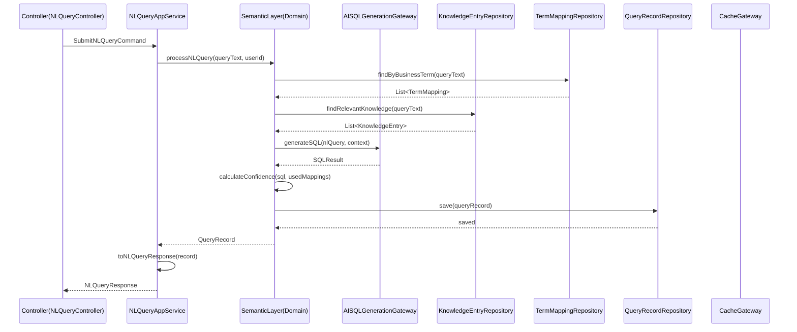

### Use Case: UC-05 数据流程执行流程

**Description:** 数据分析师执行数据流程，系统自动执行各层ETL并触发质量门禁

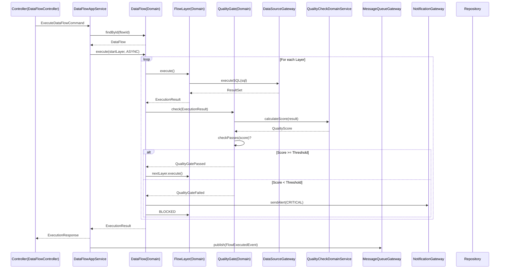

### Use Case: UC-03 SQL修正与知识提取

**Description:** 用户修正AI生成的SQL，系统提取规则并写入知识库

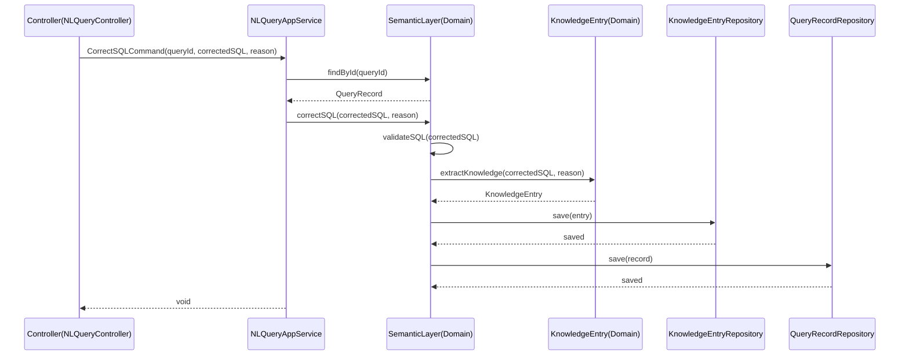

### Use Case: UC-09 指标定义与下游刷新

**Description:** 数据分析师定义新指标，系统自动刷新所有下游消费者

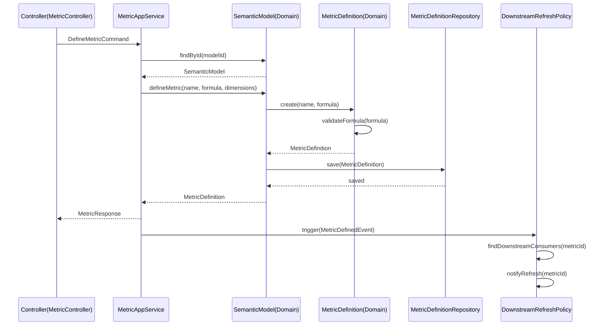

---

## 14. Flowcharts

### Business Rule: R02 质量门禁判定流程

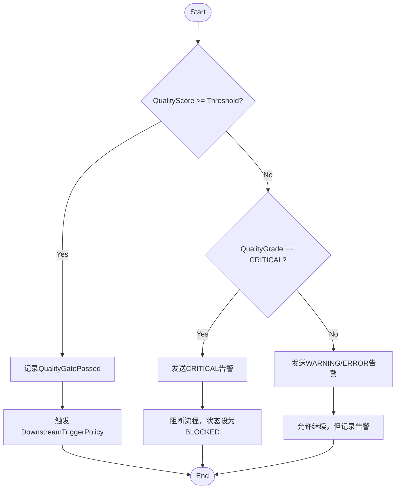

### Business Rule: SQL修正知识提取流程

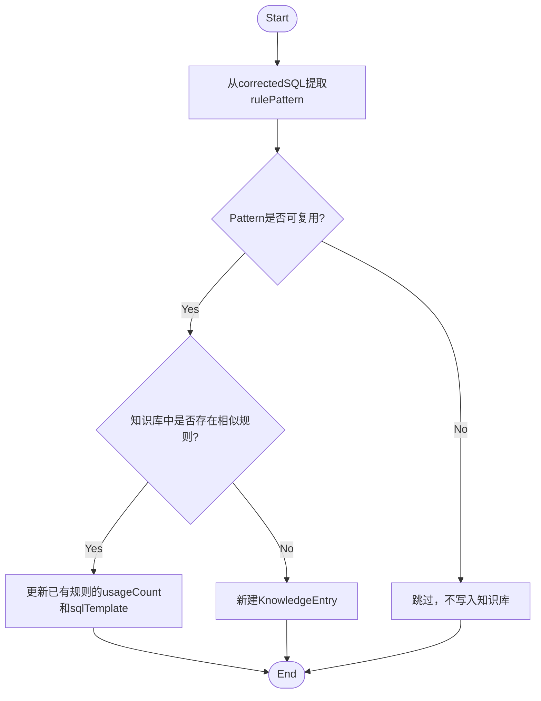

---

## 15. Domain Event Flow

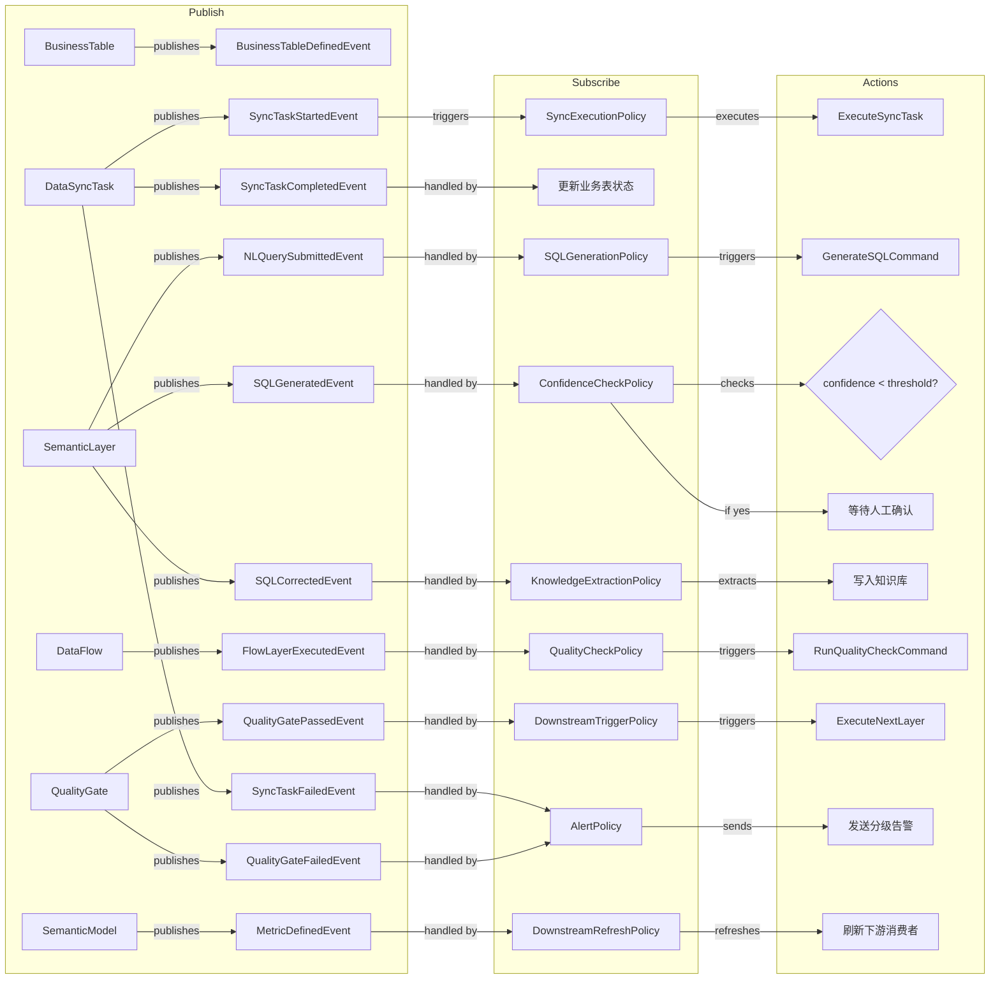

---

## 16. Package Structure (Suggested)

```
com.aiplatform.domain                              # 纯业务逻辑，无框架依赖
├── model
│   ├── entity/                                     # Aggregate Root, 核心实体
│   │   ├── BusinessTable.java                      # 业务数据表聚合根
│   │   ├── BusinessTableColumn.java
│   │   ├── BusinessTableVersion.java
│   │   ├── DataSyncTask.java                       # 数据同步聚合根
│   │   ├── DataSyncRecord.java
│   │   ├── SyncConflictLog.java
│   │   ├── DataFlow.java
│   │   ├── FlowLayer.java
│   │   ├── FlowVersion.java
│   │   ├── SemanticLayer.java
│   │   ├── QueryRecord.java
│   │   ├── TermMapping.java
│   │   ├── KnowledgeEntry.java
│   │   ├── QualityGate.java
│   │   ├── QualityTestCase.java
│   │   ├── QualityResult.java
│   │   ├── DataContract.java
│   │   ├── SemanticModel.java
│   │   ├── MetricDefinition.java
│   │   ├── DimensionDefinition.java
│   │   └── Permission.java
│   ├── vo/                                         # Value Objects
│   │   ├── semantic/
│   │   │   ├── BusinessTerm.java
│   │   │   ├── MetricFormula.java
│   │   │   ├── DimensionLevel.java
│   │   │   └── ConfidenceScore.java
│   │   ├── flow/
│   │   │   ├── DSLConfig.java
│   │   │   └── ExecutionResult.java
│   │   ├── quality/
│   │   │   └── QualityScore.java
│   │   └── permission/
│   │       ├── DataPermission.java
│   │       ├── RowFilter.java
│   │       └── ColumnMask.java
│   ├── gateway/                                    # 网关相关实体（与外部系统交互）
│   │   ├── TableMetadata.java
│   │   ├── ColumnMetadata.java
│   │   └── DataSourceConnection.java
│   └── enums/                                      # 领域枚举
│       ├── DatasourceType.java
│       ├── FlowStatus.java
│       ├── LayerStatus.java
│       ├── QualityGrade.java
│       ├── AlertLevel.java
│       ├── PermissionType.java
│       └── ExecutionMode.java
├── event/                                         # Domain Event
│   ├── DomainEventPublisher.java
│   ├── NLQuerySubmittedEvent.java
│   ├── SQLGeneratedEvent.java
│   ├── SQLCorrectedEvent.java
│   ├── FlowLayerExecutedEvent.java
│   ├── QualityGatePassedEvent.java
│   ├── QualityGateFailedEvent.java
│   └── MetricDefinedEvent.java
├── service/                                        # Domain Services
│   ├── NLQueryDomainService.java
│   ├── SQLCorrectionDomainService.java
│   ├── QualityCheckDomainService.java
│   ├── MetricQueryDomainService.java
│   └── AmbiguityResolutionDomainService.java
├── repository/                                     # Repository 接口
│   ├── DataFlowRepository.java
│   ├── SemanticLayerRepository.java
│   ├── QualityGateRepository.java
│   ├── SemanticModelRepository.java
│   ├── DataSourceRepository.java
│   ├── PermissionRepository.java
│   └── QueryRecordRepository.java
└── gateway/                                        # Gateway 接口
    ├── AISQLGenerationGateway.java
    ├── DataSourceGateway.java
    ├── TableMetadataGateway.java
    ├── SAPGateway.java
    ├── NotificationGateway.java
    ├── MessageQueueGateway.java
    └── CacheGateway.java

com.aiplatform.application                          # 编排层
├── command/                                        # Command 类
│   ├── SubmitNLQueryCommand.java
│   ├── CorrectSQLCommand.java
│   ├── ExecuteDataFlowCommand.java
│   ├── DefineMetricCommand.java
│   └── GrantPermissionCommand.java
├── service/                                        # Application Services
│   ├── NLQueryAppService.java
│   ├── DataFlowAppService.java
│   ├── DataSourceAppService.java
│   ├── MetricAppService.java
│   ├── QualityAppService.java
│   └── PermissionAppService.java
├── event/                                          # Event Listeners
│   ├── SQLGenerationPolicy.java
│   ├── KnowledgeExtractionPolicy.java
│   ├── QualityCheckPolicy.java
│   ├── DownstreamTriggerPolicy.java
│   ├── AlertPolicy.java
│   └── DownstreamRefreshPolicy.java
└── assembler/                                      # DTO Assemblers
    ├── NLQueryAssembler.java
    ├── DataFlowAssembler.java
    └── MetricAssembler.java

com.aiplatform.infrastructure                        # 技术实现层
├── repository/                                      # Repository 实现
│   ├── MyBatisDataFlowRepositoryImpl.java
│   ├── MyBatisSemanticLayerRepositoryImpl.java
│   └── JpaQualityGateRepositoryImpl.java
├── gateway/
│   ├── adapter/                                     # Gateway 适配器
│   │   ├── AISQLGenerationAdapter.java
│   │   ├── JdbcDataSourceAdapter.java
│   │   ├── JdbcMetadataAdapter.java
│   │   ├── SAPAdapter.java
│   │   ├── FeishuNotificationAdapter.java
│   │   ├── DingTalkNotificationAdapter.java
│   │   ├── EmailNotificationAdapter.java
│   │   ├── RocketMQAdapter.java
│   │   └── RedisAdapter.java
│   └── converter/                                   # 数据转换器
│       ├── AISQLGenerationConverter.java
│       ├── ConnectionParamsConverter.java
│       ├── MetadataConverter.java
│       └── NotificationConverter.java
└── config/                                          # 配置类
    ├── DatabaseConfig.java
    ├── RocketMQConfig.java
    └── SecurityConfig.java

com.aiplatform.client                                # 外部接口层
├── controller/                                      # REST Controllers
│   ├── NLQueryController.java
│   ├── DataFlowController.java
│   ├── DataSourceController.java
│   ├── MetricController.java
│   ├── QualityController.java
│   └── PermissionController.java
└── dto/                                            # Request/Response DTOs
    ├── request/
    │   ├── NLQuerySubmitRequest.java
    │   ├── SQLCorrectRequest.java
    │   ├── DataFlowCreateRequest.java
    │   └── MetricDefineRequest.java
    └── response/
        ├── NLQueryResponse.java
        ├── DataFlowResponse.java
        ├── MetricResponse.java
        └── QualityResultResponse.java
```

---

## 17. Quality Checklist

### Event Storming & Discovery (Phase 0-1)
- [x] All Actors, Commands, Specs, Events, Policies identified
- [x] Command → Aggregate → Event mapping is complete
- [x] All business nouns mapped to entities or value objects
- [x] All business rules captured with rule IDs (R01-R10)

### Tactical Design (Phase 2-3)
- [x] Aggregates are small with clear boundaries (SemanticLayer, DataFlow, QualityGate, SemanticModel, DataSource, Permission)
- [x] No cross-aggregate direct object references (use ID)
- [x] Entity behaviors are rich (no anemic model)
- [x] State machines documented for DataFlow (DRAFT→ACTIVE→PAUSED→ARCHIVED)
- [x] Naming follows project DDD conventions

### Data & Logic (Phase 4-5)
- [x] ER diagram only shows PK/FK, consistent with entity/VO tables
- [x] Entity → Table mapping covers all entities and value objects
- [x] Table Detail includes all columns with type, nullable, default
- [x] Indexes defined for FK columns, frequent queries, unique keys
- [x] Domain logic placement has clear rationale for every item

### Cross-Layer & Behavior (Phase 5.5-6)
- [x] REST API endpoints listed with URL, HTTP method, request/response types
- [x] Client DTOs (Request/Response) key fields defined
- [x] AppService methods listed with Command input and DTO output
- [x] Infrastructure adapter-to-gateway mapping is complete
- [x] Sequence diagrams cover all core use cases (UC-01, UC-03, UC-05, UC-09)
- [x] Flowcharts cover complex branching rules (质量门禁判定, SQL修正知识提取)
- [x] State machines documented for stateful entities (DataFlow)

### Ubiquitous Language & Architecture
- [x] Ubiquitous language glossary is complete with Package column
- [x] Bounded contexts identified and relationships documented
- [x] Layer dependencies respected (domain has no external imports)
- [x] Gateway per concern, adapter per gateway (ISP)
- [x] Database design decisions documented (soft delete, Value Object embedding, DSL storage)

---

## 全局检查与思考验证

### 设计思路验证

**1. 限界上下文划分是否合理？**

经过分析，系统的核心差异化在于：
- **业务数据表管理**（所有查询的基础）
- **数据同步管理**（数据从源到业务的桥梁）
- AI语义层（NL→SQL + 知识记忆）
- 质量治理（数据质量门禁）
- 语义模型（指标中心）

这五个领域被划分为**核心域**，体现了设计的核心价值主张。数据流水线、数据源、报表、可观测性等作为支撑域，权限作为横切通用域。划分合理。

**关键架构原则**：系统不直接查询源数据源。所有业务查询必须先通过数据同步，将源数据同步至业务数据表，再对业务数据表进行查询。

**2. 聚合设计是否满足DDD原则？**

- 每个聚合有明确的Aggregate Root（BusinessTable, DataSyncTask, DataFlow, SemanticLayer, QualityGate, SemanticModel, DataSource, Permission）
- 聚合内实体通过Aggregate Root对外暴露，不直接被外部访问
- 跨聚合引用使用ID而非直接对象引用
- 聚合内包含的不变量（如R01, R02, R07）在Aggregate Root中强制执行

**3. 领域事件设计是否覆盖核心业务流程？**

核心业务流程（业务表定义→数据同步→NL查询→SQL生成→流程执行→质量门禁）均有对应的事件驱动设计：
- BusinessTableDefined → 配置同步任务
- SyncTriggered → SyncTaskStarted → SyncTaskCompleted/SyncTaskFailed
- NLQuerySubmitted → SQLGenerationPolicy → GenerateSQL
- FlowLayerExecuted → QualityCheckPolicy → RunQualityCheck
- QualityGateFailed → AlertPolicy + FlowBlockPolicy
- SQLCorrected → KnowledgeExtractionPolicy → 知识库更新

**4. Gateway接口设计是否合理？**

Gateway接口按外部系统职责划分（AI服务、数据源、SAP、消息队列、缓存、通知），每个Gateway有明确的Adapter实现，符合接口隔离原则（ISP）。

**5. 存储策略是否合理？**

- Value Object采用嵌入父表策略，减少关联查询
- DSL配置使用TEXT(JSON)存储，灵活应对结构变化
- 软删除策略支持业务审计需求
- 连接参数加密存储保证安全性

**6. 新增架构原则验证**

- 业务数据表优先：SemanticLayer只查询BusinessTable，不直接查询DataSource
- 数据同步隔离：DataSyncTask负责从TableMetadata同步到BusinessTable
- 源数据源仅用于元数据采集和数据同步，不直接对外提供查询

**潜在风险与应对：**

| 风险 | 影响程度 | 应对措施 |
| ---- | -------- | -------- |
| AI SQL准确率不足 | 高 | 置信度阈值强制人工确认；知识积累提升准确率 |
| 业务表数据同步延迟 | 高 | 增量同步+实时同步策略；监控同步任务状态 |
| 语义层配置成本高 | 中 | AI自动推荐映射；默认模板降低配置成本 |
| 质量门禁误阻断 | 中 | 分级告警而非直接阻断；白名单豁免 |
| 同步冲突处理 | 中 | 配置冲突处理策略；冲突日志记录和告警 |

---

*文档生成日期：2026-03-30*
*来源：AI数据分析系统PRD.md*
*版本：v1.1 — 新增业务数据表上下文、数据同步上下文；确立业务数据表优先原则（所有查询必须基于业务数据表，不直接查询源数据源）*
